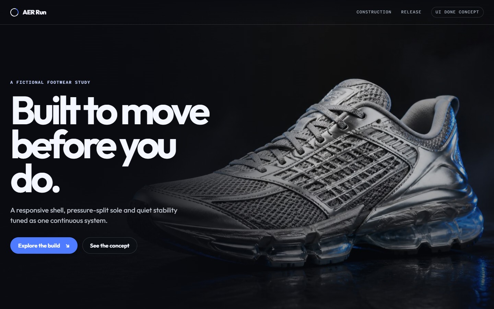
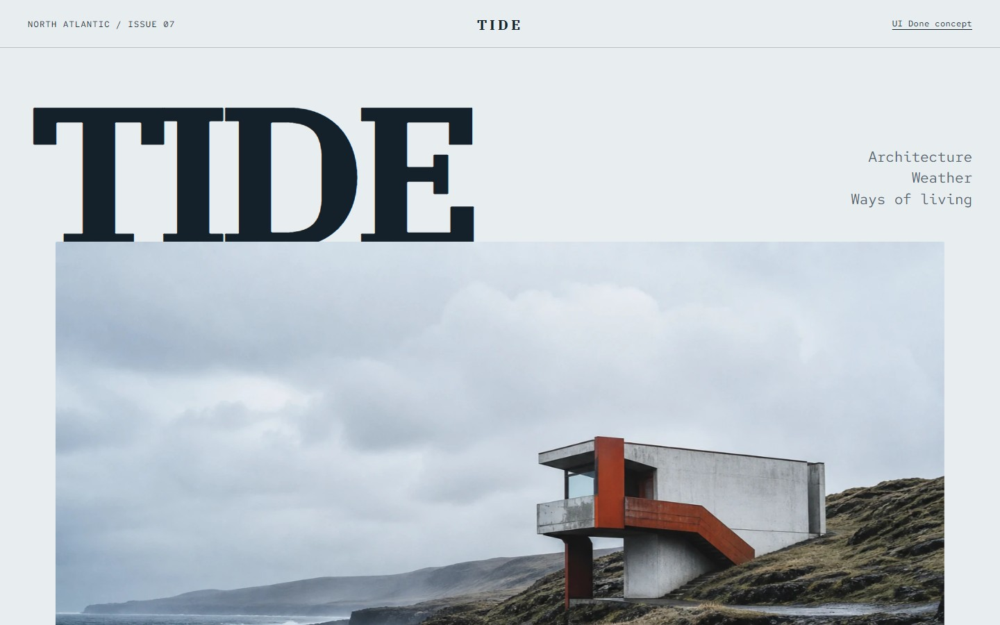
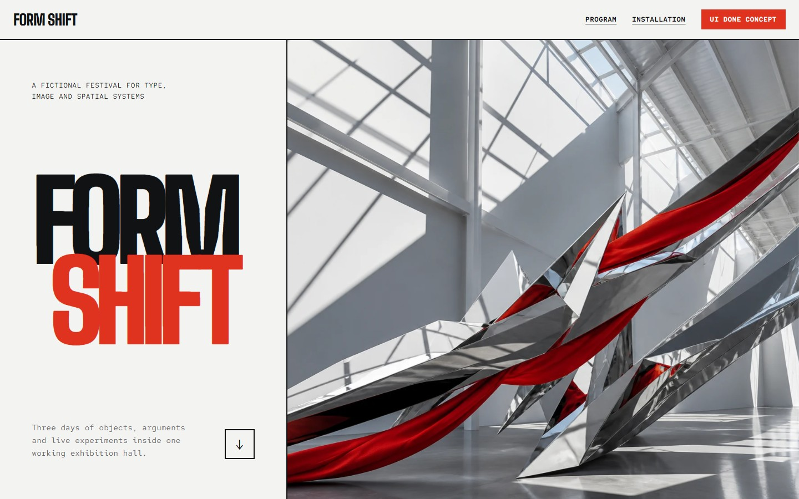
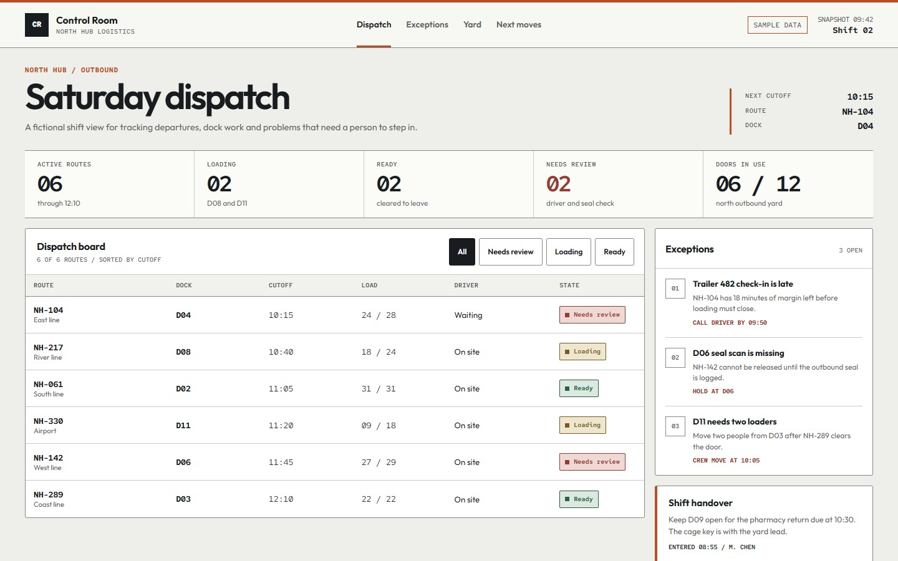
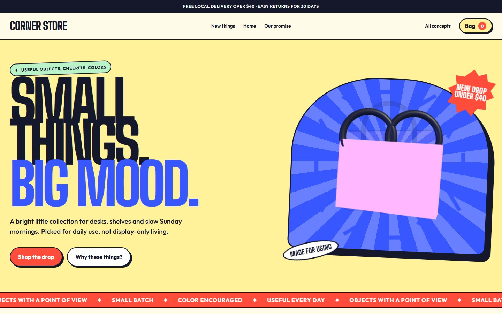
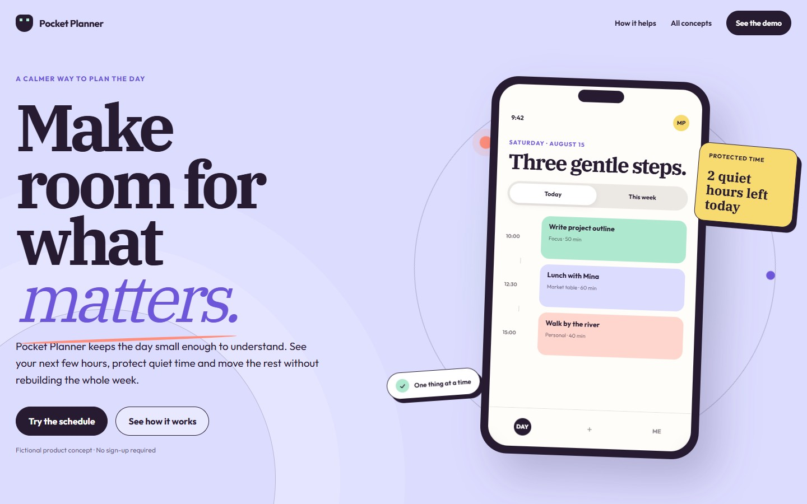

<div align="center">

# UI Done

**给 Agent 用的前端 Skill：先看项目，再做页面，最后进浏览器检查。**

不绑定某一家 Agent；只要它能读取 Skill 或项目文件，就能照着用。

[在线展厅](https://ww-cooooo.github.io/ui-done/showcase/gallery/) · [安装](#安装) · [第一次使用](#第一次使用) · [MIT License](./LICENSE)

</div>

<p align="center">
  <a href="https://ww-cooooo.github.io/ui-done/showcase/gallery/">
    
  </a>
</p>

<p align="center">
  <strong><a href="https://ww-cooooo.github.io/ui-done/showcase/gallery/">点上面的图，直接看页面展厅 →</a></strong>
</p>

<details>
<summary> <strong>6 个页面的大图和在线链接</strong></summary>

<br>

<table>
  <tr>
    <td width="50%" align="center">
      <a href="https://ww-cooooo.github.io/ui-done/showcase/aer-run/"></a><br>
      <strong>AER Run</strong><br>跑鞋产品页 · <a href="https://ww-cooooo.github.io/ui-done/showcase/aer-run/">打开页面</a>
    </td>
    <td width="50%" align="center">
      <a href="https://ww-cooooo.github.io/ui-done/showcase/tide-journal/"></a><br>
      <strong>Tide Journal</strong><br>海岸杂志 · <a href="https://ww-cooooo.github.io/ui-done/showcase/tide-journal/">打开页面</a>
    </td>
  </tr>
  <tr>
    <td width="50%" align="center">
      <a href="https://ww-cooooo.github.io/ui-done/showcase/form-shift/"></a><br>
      <strong>Form Shift</strong><br>设计节日程 · <a href="https://ww-cooooo.github.io/ui-done/showcase/form-shift/">打开页面</a>
    </td>
    <td width="50%" align="center">
      <a href="https://ww-cooooo.github.io/ui-done/showcase/control-room/"></a><br>
      <strong>Control Room</strong><br>物流调度台 · <a href="https://ww-cooooo.github.io/ui-done/showcase/control-room/">打开页面</a>
    </td>
  </tr>
  <tr>
    <td width="50%" align="center">
      <a href="https://ww-cooooo.github.io/ui-done/showcase/corner-store/"></a><br>
      <strong>Corner Store</strong><br>家居小店 · <a href="https://ww-cooooo.github.io/ui-done/showcase/corner-store/">打开页面</a>
    </td>
    <td width="50%" align="center">
      <a href="https://ww-cooooo.github.io/ui-done/showcase/pocket-planner/"></a><br>
      <strong>Pocket Planner</strong><br>日程应用 · <a href="https://ww-cooooo.github.io/ui-done/showcase/pocket-planner/">打开页面</a>
    </td>
  </tr>
</table>

</details>

## 它是做什么的

UI Done 不是一套固定模板。它是一份给 Agent 的工作说明，入口在 [`skill/ui-done/SKILL.md`](./skill/ui-done/SKILL.md)。无论是新做页面，还是整理一个已经写到一半的前端，Agent 都要先看清现有项目，再决定怎么改、用哪些工具、最后检查什么。

刚接触前端，可以直接从下面的示例提示开始。会写代码的话，再补上框架、目录和验收要求就行。项目越复杂，需要交代的现有接口和限制也会越多。

## 不用先替 Agent 选技术

这是 UI Done 和普通前端提示词很不一样的地方。即使需求里没有点名具体工具，Agent 也会主动检查 UI 框架或组件库、动画、平滑滚动、3D / Canvas、图表、图标资源和性能优化。像 React、Motion、Lenis、Three.js、Chart.js 这类工具，只要确实能帮到页面，就会安排进来。

这对刚接触前端，或者会写一点代码、但不是专门做前端的人更省事。你先讲清页面给谁用、要做什么、希望是什么感觉；具体选什么，由 Agent 结合现有项目判断。它不会为了凑技术栈硬加 3D、假图表或多余的动画开关。没有合适的位置，就只做贴合页面的小点缀，或者说明为什么这次不使用。

## 安装

两种方式，选一种。

### 用 npx 安装

电脑里已经有 Node.js，可以运行：

```bash
npx skills add Ww-Cooooo/ui-done -g
```

安装程序让你选择 Agent 时，选平时使用的那个。

### 把安装交给 Agent

不想处理命令行，就把这段发给 Agent：

```text
请帮我安装 UI Done：
https://github.com/Ww-Cooooo/ui-done

先读仓库根目录的 INSTALL.md，再按适合当前 Agent 的方法安装。
如果已经有同名 Skill，不要直接覆盖，先问我是更新还是重装。
装好后告诉我安装位置，以及下次怎么调用。
```

[查看完整安装说明](./INSTALL.md)

## 第一次使用

把方括号里的内容换成自己的话，然后发给 Agent：

```text
请用 UI Done 帮我【新建 / 改进】当前页面。

这个页面给【谁】使用，主要要完成【什么】。
请保留【不能改的文字、功能、数据或样式】。
我希望它看起来【例如：安静一点、像纸质杂志、信息更清楚】。

开始前先看现有项目。如果需要换框架、改变交付方式或接入付费服务，先问我。
完成后请在浏览器里检查电脑和手机，并告诉我还有什么没有验证。
```

不必先学设计术语。“字大一点”“别太花”“像一本杂志”都能说明方向。有参考图或参考网站，也可以一起交给 Agent。

| 你现在的情况 | 建议再告诉 Agent 什么 |
| --- | --- |
| 刚接触 Agent 或前端 | 先用上面的提示词。遇到安装、启动或配置步骤时，让 Agent 解释清楚再继续。 |
| 会一点代码 | 加上项目框架、允许修改的目录、参考页面和不能动的文件。 |
| 经常写代码 | 直接给范围、技术边界和验收尺寸；支持 Skill 名称调用时，可以写 `$ui-done`。 |

## 它做事的规矩

- 先读项目说明、页面结构、现有技术栈和未提交改动，再开始写。
- 即使用户没有点名，也会主动检查 UI、动画、滚动、3D、图表、图标和性能工具；能用的尽量用，但每个工具都要有实际工作。
- 不为了凑技术栈编造内容。动画跟着内容和状态走；3D 要帮助表达产品或空间；图表只在真有数据时出现。没有合适主位，就收成贴合页面的小点缀。
- 能打开浏览器时，会检查电脑和手机尺寸、主要操作、缺图、溢出和报错。检查不了的部分要写清楚。
- 发布网站、推送远端、提交真实表单、付款、发消息和删除数据，需要用户明确同意。API Key、Token、Cookie 和私钥不能写进前端页面。

<details>
<summary> <strong>给会写代码的人：技术栈、文件和检查命令</strong></summary>

<br>

示例展厅里的主工具如下。它们不是每个项目都必须照搬，实际选型以现有项目和页面内容为准。

| 工作 | 示例展厅选用 |
| --- | --- |
| UI 与状态 | React |
| 动画 | Motion |
| 平滑滚动 | Lenis |
| 3D / Canvas | Three.js |
| 图表 | Chart.js |
| 图标与资源 | 本地 SVG、图片和字体 |
| 性能 | react-intersection-observer、Size Limit |
| 构建 | Vite |

常用入口：

- [`skill/ui-done/SKILL.md`](./skill/ui-done/SKILL.md)：Skill 本体
- [`skill/ui-done/references/`](./skill/ui-done/references/)：选型、字体、动效和浏览器检查
- [`skill/ui-done/scripts/`](./skill/ui-done/scripts/)：静态预检脚本
- [`showcase/`](./showcase/)：六个示例页和展厅

静态预检需要 Python 3.10 或更高版本：

```powershell
python .\skill\ui-done\scripts\frontend_preflight.py .\showcase --offline
```

macOS 或 Linux 把 `python` 改成 `python3`。重新构建并检查示例时，运行 `pnpm run check`。

</details>

## 开源、反馈和安全

项目自己编写的 Skill、脚本、文档和示例页面代码使用 [MIT License](./LICENSE)。安装或使用中遇到问题，可以打开[问题反馈表单](https://github.com/Ww-Cooooo/ui-done/issues/new?template=problem.yml)；涉及密钥、权限或可疑命令时，请按[安全说明](./SECURITY.md)私下报告。

仓库里的第三方依赖、字体和示例图片有各自的许可或来源说明，不能全部按项目的 MIT License 处理。

<details>
<summary> <strong>第三方资源：完整声明</strong></summary>

<br>

- React、Motion、Lenis、Three.js、Chart.js 等示例运行时依赖使用各自的 MIT 或 0BSD 许可。精确版本、版权文字和完整许可证随打包文件保存在 [`showcase/shared/runtime/THIRD_PARTY_LICENSES.txt`](./showcase/shared/runtime/THIRD_PARTY_LICENSES.txt)。
- Outfit、IBM Plex Serif、Red Hat Mono 和 Big Shoulders 字体使用 SIL Open Font License 1.1，原作者版权声明和许可证文件保留在仓库中。
- 示例源图由本项目使用 OpenAI ImageGen 生成，在项目能够授权的范围内提供；AI 输出不保证唯一。
- 文件清单、哈希、来源、作者声明和适用范围见 [`THIRD_PARTY_NOTICES.md`](./THIRD_PARTY_NOTICES.md)。再分发仓库或打包后的示例时，请一并保留适用的声明和许可证。

</details>
