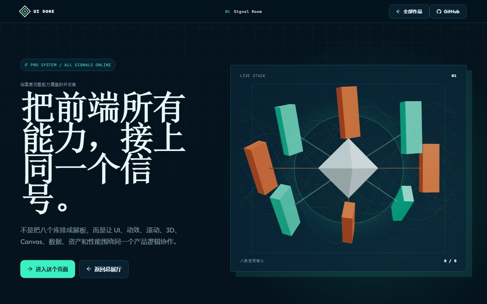
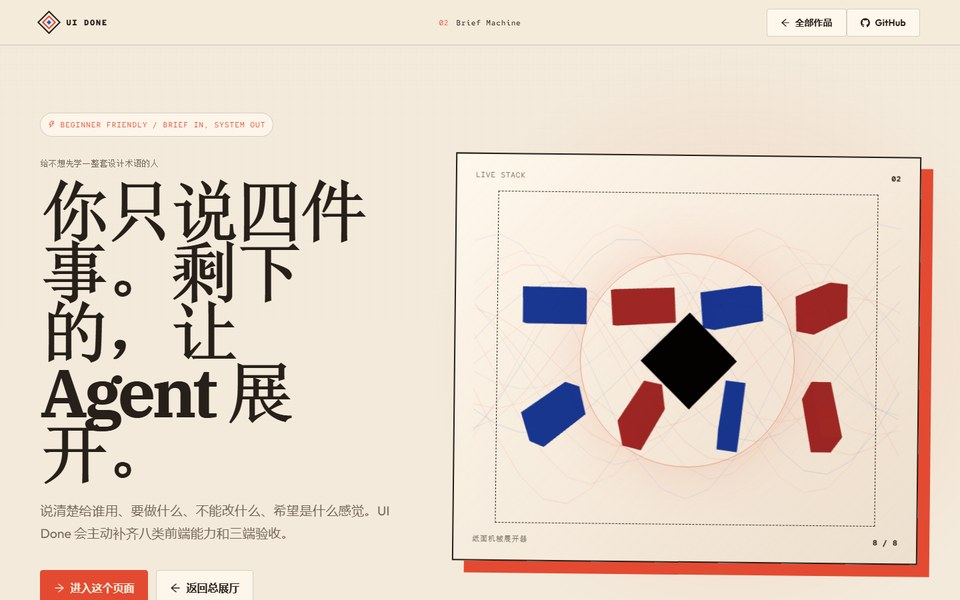
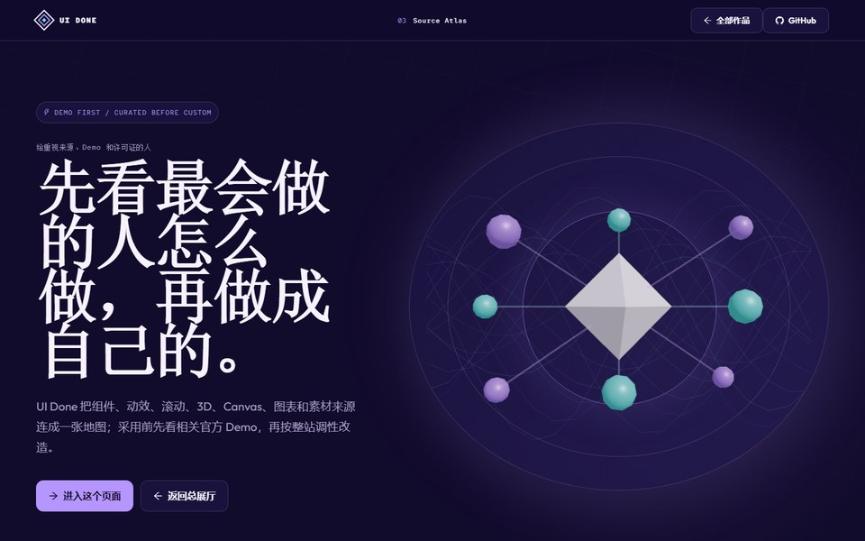
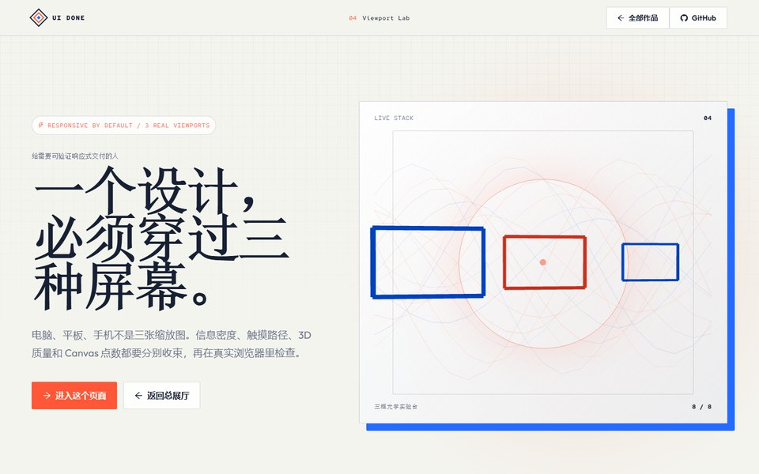
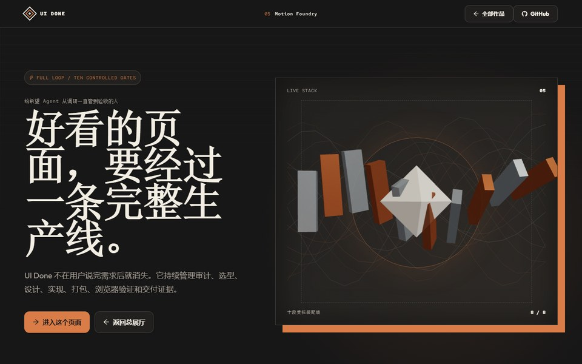
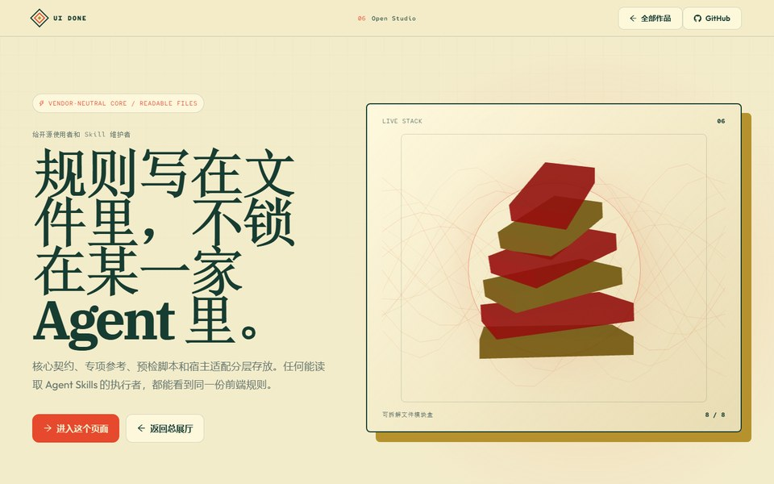

<div align="center">

# UI Done

**给 Agent 用的前端 Skill：先看项目，再做页面，最后进浏览器检查。**

核心采用开放的 [Agent Skills](https://agentskills.io/) 文件格式，不绑定 OpenAI、Anthropic、Google 或其他厂商。支持该标准的 Agent 可以发现并加载它；不支持自动发现的 Agent 也可以把整份 Skill 注册为项目或系统说明。

[在线展厅](https://ww-cooooo.github.io/ui-done/showcase/gallery/) · [安装](#安装) · [第一次使用](#第一次使用) · [MIT License](./LICENSE)

</div>

<p align="center">
  <a href="https://ww-cooooo.github.io/ui-done/showcase/gallery/">
    
  </a>
</p>

<p align="center">
  <strong><a href="https://ww-cooooo.github.io/ui-done/showcase/gallery/">点上面的图，直接看页面展厅 →</a></strong>
</p>

展厅里的六个页面全部由当前版本的 UI Done 从零重建。它们不是把同一模板换六套颜色：每一页都围绕 UI Done 的真实规则、素材来源、三端验收或安装结构展开，并把 React、Ant Design、Anime.js、Lenis、R3F、Pts 与 AntV G2 融进同一个页面任务。页面没有调用远程运行时，也没有为了展示图表编造业务数据。

<details>
<summary> <strong>6 个页面的大图和在线链接</strong></summary>

<br>

<table>
  <tr>
    <td width="50%" align="center">
      <a href="https://ww-cooooo.github.io/ui-done/showcase/signal-room/"></a><br>
      <strong>Signal Room</strong><br>完整能力协调台 · <a href="https://ww-cooooo.github.io/ui-done/showcase/signal-room/">打开页面</a>
    </td>
    <td width="50%" align="center">
      <a href="https://ww-cooooo.github.io/ui-done/showcase/brief-machine/"></a><br>
      <strong>Brief Machine</strong><br>一句话展开八层 · <a href="https://ww-cooooo.github.io/ui-done/showcase/brief-machine/">打开页面</a>
    </td>
  </tr>
  <tr>
    <td width="50%" align="center">
      <a href="https://ww-cooooo.github.io/ui-done/showcase/source-atlas/"></a><br>
      <strong>Source Atlas</strong><br>官方素材来源地图 · <a href="https://ww-cooooo.github.io/ui-done/showcase/source-atlas/">打开页面</a>
    </td>
    <td width="50%" align="center">
      <a href="https://ww-cooooo.github.io/ui-done/showcase/viewport-lab/"></a><br>
      <strong>Viewport Lab</strong><br>三端响应实验台 · <a href="https://ww-cooooo.github.io/ui-done/showcase/viewport-lab/">打开页面</a>
    </td>
  </tr>
  <tr>
    <td width="50%" align="center">
      <a href="https://ww-cooooo.github.io/ui-done/showcase/motion-foundry/"></a><br>
      <strong>Motion Foundry</strong><br>十段完整生产线 · <a href="https://ww-cooooo.github.io/ui-done/showcase/motion-foundry/">打开页面</a>
    </td>
    <td width="50%" align="center">
      <a href="https://ww-cooooo.github.io/ui-done/showcase/open-studio/"></a><br>
      <strong>Open Studio</strong><br>跨 Agent 可读文件 · <a href="https://ww-cooooo.github.io/ui-done/showcase/open-studio/">打开页面</a>
    </td>
  </tr>
</table>

</details>

## 它是做什么的

UI Done 不是一套固定模板。它是一份给 Agent 的工作说明，入口在 [`skill/ui-done/SKILL.md`](./skill/ui-done/SKILL.md)。无论是新做页面，还是整理一个已经写到一半的前端，Agent 都要先看清现有项目，再决定怎么改、用哪些工具、最后检查什么。

刚接触前端，可以直接从下面的示例提示开始。会写代码的话，再补上框架、目录和验收要求就行。项目越复杂，需要交代的现有接口和限制也会越多。

## 它对小白好在哪：把主动规划交给 Agent

不同前端 Skill 的定位并不一样；UI Done 不声称所有其他 Skill 都只会被动执行。它明确选择了一种更适合非专业用户的分工：不把“先写一份专业技术和设计方案”当成使用前提，而是把主动规划交给 Agent。入门时，你只要说清楚这个页面或看板给谁用、要完成什么、哪些内容不能改，以及大概希望它是什么感觉，剩下的选型、组合、实现和检查由 Agent 主动补齐；项目复杂时，再补接口、目录和交付限制。

下面比较的是“需要用户逐项点名”的执行方式与 UI Done 的默认做法，范围是完整页面、新站点或较大的改版。只改一段文字、一个间距、一个颜色值或孤立的小问题时，UI Done 会保持改动范围，不会为了凑清单给项目加一整套视觉技术。

| 事情 | 需要用户逐项点名的方式 | UI Done 的默认做法 |
| --- | --- | --- |
| 开始前要懂多少 | 用户先列出框架、组件和效果 | 用户只需说清用途、对象、限制和感觉 |
| 页面基础 | 没点名时可能只做基础控件 | 固定使用 React，并要求一个主 UI 组件系统，默认 Ant Design |
| 视觉增强 | 动画、滚动、3D 或 Canvas 要逐项提出 | 先为动画、Lenis 滚动、真实 3D/WebGL 和独立 2D Canvas 各规划一个真实角色 |
| 数据看板 | 用户先决定要不要图表、用什么图表 | 发现真实可视化对象时主动选一个主人，优先 AntV，适合时改用 ECharts，不编造数据 |
| 组件、动效、可视化或素材来源 | 知道库名才可能去找示例 | 认真比较或采用一个来源前，默认先看与当前用途相关的官方 Demo，再按整站调性改造 |
| 图标与性能 | 容易留到最后或被漏掉 | 同时规划图标/资源和实际需要的性能手段 |
| 设备检查 | 用户逐个给出尺寸 | 能使用浏览器时，默认检查电脑、平板和手机，再按特殊要求扩展 |
| Agent 自己工作时 | 可能只在用户最初提到时生效 | 调研、增删改代码、重构、测试、打包和交付阶段都继续遵守同一套规则 |

它倾向于先把一个页面能诚实实现的视觉上限做出来，而不是先交一张安全但普通的基础页面：该有层次、动感、数据表达和空间感时，就积极把这些手段用起来，做出更丰富、更有记忆点的第一版。你觉得还不够“花”，可以让它继续加强；觉得太炫、太动、太重，也只需要用自然语言让它收一点，不必回头补一份专业设计说明书。

主动不等于无脑堆料。每种工具仍要服务现有内容和操作，不能为了展示技术硬加栏目、假数据、无用按钮或照搬 Demo。没有自然主位置时，它会把能力收成贴合页面的小点缀；只有遇到明确的内容、访问、安全、兼容或运行硬限制时，才允许不用。

这是一项有意的产品取向，不是“只评估一下、能少用就少用”：完整页面和较大改版默认要让每个类别至少承担一个真实角色，区别在于角色可以很小、很安静。它更适合希望先得到丰富第一版、再逐步收敛的人；如果项目的硬要求就是零新增依赖、零动效或只用原生能力，应当一开始说清楚，这可能形成豁免，也可能意味着 UI Done 的完整改版路线并不适合该项目。

## 正确加载后，各 Agent 获得同一份核心规则

- [`SKILL.md`](./skill/ui-done/SKILL.md) 是唯一权威运行契约，触发、规划、选型、编码、测试和交付规则都放在这里；README 是面向使用者的摘要，两者冲突时以完整契约为准。
- `skill/ui-done/agents/` 只保存某些宿主可选的发现适配信息，不能修改或削弱核心规则。其他 Agent 不读取这些适配文件，也不会因此丢失写在核心契约里的规则；能调用哪些工具、实际执行到什么程度，仍取决于当前宿主。
- 支持 Agent Skills 的宿主会先读取 `name` 和 `description`，匹配前端任务后再加载完整说明。宿主不支持 Skill 发现时，需要在它的项目规则、系统说明或技能注册界面中加载整个 `skill/ui-done` 文件夹；如果宿主从未看到 Skill 元数据，就不能声称已经自动触发。
- 显式调用写法由宿主决定，可能是 `$ui-done`、`/ui-done`、`@ui-done`、菜单选择或自然语言。UI Done 不把任何一家厂商的写法当成唯一入口。
- Agent 在自己调研、增删改代码、重构、调试、测试、打包或创建已授权前端子任务时，也必须重新判断是否进入前端范围；一旦进入，就持续遵守 UI Done 到交付结束。
- 前端子任务的执行者必须单独获得完整 `skill/ui-done` 文件夹及当前任务边界，不能假定它会自动继承父 Agent 已经读取的 Skill。宿主工具、上下文和更高优先级规则不同，结果可能不同；相同的是可读取的核心契约。

## 默认主动用，不等你点名

这是 UI Done 最核心的优势之一。做完整页面、新站点或较大的改版时，即使用户没有指定任何库，Agent 也会主动从下面这些类别里选择合适的主工具，并真正用进页面：

- React 和一个主 UI 组件系统，默认 Ant Design
- 动画库和平滑滚动
- 分开的真实 3D/WebGL 与 2D Canvas 工具
- 有真实数据时优先使用 AntV；当 ECharts 更适合真实数据、交互、交付或现有技术栈时改用 ECharts
- 图标、图片、字体等资源系统
- 加载、体积和运行性能工具

React 是固定框架，主 UI 组件系统默认使用 Ant Design；其他类别会从现有项目和素材库中选择兼容主人，例如 Anime.js、Lenis、Three.js/React Three Fiber、Pts 或 Fabric.js。可视化优先 AntV，当 ECharts 更适合真实数据、交互、交付或现有技术栈时改用 ECharts。它不会因为用户没说库名，就只交付一套最基础的页面。这对刚接触前端，或者会写一点代码、但不是专门做前端的人尤其有用：你负责说清页面给谁用、要做什么、希望是什么感觉，UI Done 负责把容易漏掉的前端选型补上。

确定要认真比较或采用某个组件库、动效库、可视化库或素材来源后，Agent 会先打开它的官方 Demo，查看与当前用途真正相关的示例，再按整站调性改造。不要求把无关展厅全部刷完，也不会把 Demo 的示例文字、假数据、控制栏和展示外壳原样搬进产品。查看 Demo 不等于获得复制代码的许可；要使用示例代码或资源，仍会核对上游来源、许可证和修改记录。查看过程中也不能向第三方网站上传项目代码、内部截图、凭据或其他私密内容。

主动使用也不等于乱塞。每个工具都必须服务页面原本的内容和操作，不能为了凑技术栈硬加 3D、假图表或多余的动画开关。没有合适的主位置，先把它收成贴合页面的小点缀；只有在内容真实性、访问、许可证、安全、兼容或运行条件形成明确硬限制时，才允许不用并记录原因。

## 安装

两种方式，选一种。

### 用 npx 安装

电脑里已经有 Node.js，可以运行：

```bash
npx skills add Ww-Cooooo/ui-done -g
```

安装程序让你选择 Agent 时，选平时使用的那个。

### 把安装交给 Agent

不想处理命令行，就把这段发给 Agent：

```text
请帮我安装 UI Done：
https://github.com/Ww-Cooooo/ui-done

先读仓库根目录的 INSTALL.md，再按适合当前 Agent 的方法安装。
如果已经有同名 Skill，不要直接覆盖，先问我是更新还是重装。
装好后告诉我安装位置，以及下次怎么调用。
```

[查看完整安装说明](./INSTALL.md)

## 第一次使用

先确认当前 Agent 已经打开正确项目，并且能够读取和修改文件、运行所需命令；需要真实浏览器验收时，还要有可用的浏览器工具。普通网页聊天如果没有工作区或工具权限，只能提供规划、代码建议或审查，不能声称已经改好并验证。需要新增依赖或改变包管理器、构建配置时，由 Agent 先说明新增内容和影响，你仍不需要自己决定库名。

把方括号里的内容换成自己的话，然后发给 Agent：

```text
请用 UI Done 帮我【新建 / 改进】当前页面。

这个页面给【谁】使用，主要要完成【什么】。
请保留【不能改的文字、功能、数据或样式】。
我希望它看起来【例如：安静一点、像纸质杂志、信息更清楚】。

开始前先看现有项目。如果需要换框架、改变交付方式或接入付费服务，先问我。
完成后请在浏览器里检查电脑、平板和手机，并告诉我还有什么没有验证。
```

不必先学设计术语，也不用自己列一份前端工具清单。“字大一点”“再炫一点”“别太花”“像一本杂志”都能说明方向；先看第一版，再继续让 Agent 加强或收敛。有参考图或参考网站，也可以一起交给 Agent。

| 你现在的情况 | 建议再告诉 Agent 什么 |
| --- | --- |
| 刚接触 Agent 或前端 | 先用上面的提示词。遇到安装、启动或配置步骤时，让 Agent 解释清楚再继续。 |
| 会一点代码 | 加上项目框架、允许修改的目录、参考页面和不能动的文件。 |
| 经常写代码 | 直接给范围、技术边界和验收尺寸；支持 Skill 名称调用时，使用当前 Agent 支持的 `$ui-done`、`/ui-done`、`@ui-done` 或选择器。 |

## 它做事的规矩

- 先读项目说明、页面结构、现有技术栈和未提交改动，再开始写；保留用户已有修改，不能为了方便覆盖或丢弃，遇到重叠冲突先说明。
- 现有项目不是 React 时，先说明完整迁移的范围和影响；不能偷偷混入 React 小岛，也不能未经同意改掉用户已经批准的架构。用户不批准迁移时，停止实施并只提供审查结果或迁移方案，不继续编写原框架的新页面；只要求审查时，报告迁移影响而不改代码。
- React 项目已经有一套被批准的主 UI 组件系统时，优先保留它；新项目或没有主人的界面默认使用 Ant Design，不能为了采用 Ant Design 再叠一套并行组件系统。
- 做完整页面或较大改版时，即使用户没有点名，也会先为 React UI、动画、滚动、真实 3D、独立 2D Canvas、可视化、图标和性能工具规划主方案并实际使用；省略必须有明确硬理由。
- 认真比较或采用组件库、动效库、可视化库或素材来源时，先看与当前用途相关的官方 Demo，记录采用、改造或拒绝的原因；除非存在明确的访问、安全或网络硬限制，否则不能跳过。
- 不为了凑技术栈编造内容。动画跟着内容和状态走；3D 要帮助表达产品或空间；图表只在真有数据时出现。没有合适主位，就收成贴合页面的小点缀。
- 能打开浏览器时，会用代表性的电脑、平板和手机视口检查主要操作、缺图、溢出和报错；这不等于已经在三台真实设备和所有移动浏览器上测试。检查不了的部分要写清楚。
- 发布网站、推送远端、提交真实表单、付款、发消息和删除数据，需要用户明确同意。API Key、Token、Cookie 和私钥不能写进前端页面。

<details>
<summary> <strong>给会写代码的人：技术栈、文件和检查命令</strong></summary>

<br>

当前示例展厅就是最新版 UI Done 的一套完整实现。总入口和六个作品都是 React 页面，共享生命周期、故障回退和构建基础设施，但每页的字体、色彩、密度、布局骨架、3D 物体、Canvas 图形和 AntV 图表都根据各自任务重新设计。

| 工作 | 示例展厅选用 |
| --- | --- |
| 页面主体与交互 | React 19 + Ant Design 6；按钮、Drawer、Steps、表单、分段选择、卡片与主题 token 都由同一组件系统负责 |
| 动画 | Anime.js 4；负责首屏编排、滚动进入与状态连续性，降低动效时切成静态完成态 |
| 平滑滚动 | Lenis 1；负责电脑、平板、手机的同一滚动路径，并保留锚点、历史返回、键盘和 Ant Design 浮层 |
| 真实 3D/WebGL | Three.js + React Three Fiber；每页使用不同的程序化空间对象，并提供不支持 WebGL 时的静态等价层 |
| 独立 2D Canvas | Pts；负责与页面主题一致的程序化线场，和 3D 生命周期分开，2D context 不可用时不阻断正文 |
| 数据可视化 | AntV G2；只使用仓库与 UI Done 的真实数据，滚动接近图表时才加载，并保留隐藏文字表格作为等价内容 |
| 图标与字体 | Ant Design Icons 按需导入；Outfit、IBM Plex Serif、Red Hat Mono、Big Shoulders 全部本地打包 |
| 性能 | React lazy、Vite 分块、离屏/隐藏暂停、高级层故障回退和 Size Limit |
| 构建 | Vite 8；生成相对资源路径、第三方许可证汇总和入口内容哈希 |

常用入口：

- [`skill/ui-done/SKILL.md`](./skill/ui-done/SKILL.md)：Skill 本体
- [`skill/ui-done/references/`](./skill/ui-done/references/)：选型、字体、动效和浏览器检查
- [`skill/ui-done/scripts/`](./skill/ui-done/scripts/)：静态预检脚本
- [`showcase/`](./showcase/)：总展厅、六个独立作品和共享 React 运行时

静态预检需要 Python 3.10 或更高版本：

```powershell
python .\skill\ui-done\scripts\frontend_preflight.py .\showcase --offline
```

macOS 或 Linux 把 `python` 改成 `python3`。重新构建并检查示例时，运行 `pnpm run check`。

</details>

## 开源、反馈和安全

项目自己编写的 Skill、脚本、文档和示例页面代码使用 [MIT License](./LICENSE)。安装或使用中遇到问题，可以打开[问题反馈表单](https://github.com/Ww-Cooooo/ui-done/issues/new?template=problem.yml)；涉及密钥、权限或可疑命令时，请按[安全说明](./SECURITY.md)私下报告。

仓库里的第三方依赖、字体和示例图片有各自的许可或来源说明，不能全部按项目的 MIT License 处理。

<details>
<summary> <strong>第三方资源：完整声明</strong></summary>

<br>

- React、Ant Design、Ant Design Icons、Anime.js、Lenis、Three.js、React Three Fiber、Pts、AntV G2 等示例运行时依赖使用各自的 MIT、Apache-2.0、0BSD 或 ISC 许可。精确版本、版权文字和完整许可证随打包文件保存在 [`showcase/shared/runtime/THIRD_PARTY_LICENSES.txt`](./showcase/shared/runtime/THIRD_PARTY_LICENSES.txt)。
- Outfit、IBM Plex Serif、Red Hat Mono 和 Big Shoulders 字体使用 SIL Open Font License 1.1，原作者版权声明和许可证文件保留在仓库中。
- 文件清单、哈希、来源、作者声明和适用范围见 [`THIRD_PARTY_NOTICES.md`](./THIRD_PARTY_NOTICES.md)。再分发仓库或打包后的示例时，请一并保留适用的声明和许可证。

</details>
