<div align="center">

# UI Done

**给 Agent 用的前端 Skill：你说清目标，它主动补齐产品结构、视觉系统，并在工具允许时完成浏览器验收。**

核心采用开放的 [Agent Skills](https://agentskills.io/) 文件格式，不绑定 OpenAI、Anthropic、Google 或其他厂商。支持该标准的 Agent 可以发现并加载它；不支持自动发现的 Agent 也可以把整份 Skill 注册为项目或系统说明。

这里的 **Agent** 是能够打开项目、修改代码和运行工具的 AI 助手；**Skill** 是交给它遵守的一整套规则文件。UI Done 不是独立建站软件，也不是点一下就套用的页面模板。它负责前端设计与实现，不会凭空提供后端、真实业务数据或网站发布；这些需要作为单独任务说明，并在涉及外部写入时由用户授权。

> [!IMPORTANT]
> 安装前先知道：新页面、新组件和较大改版固定走 React，主 UI 系统默认 Ant Design；已有非 React 项目的纯文字、颜色或资源小修可以保持原范围，但继续开发原框架页面不属于 UI Done 的实现路线。跨 Agent 指“同一套规则文件可以被读取”，不代表每个宿主都会自动发现、拥有同样工具或产出同样结果。动画、Lenis 和独立 2D Canvas 是完整改版的强默认能力；图表只有存在真实可视化对象时才必用，3D 则只有通过严格适配门槛才采用。

[在线展厅](https://ww-cooooo.github.io/ui-done/showcase/gallery/) · [安装](#安装) · [第一次使用](#第一次使用) · [MIT License](./LICENSE)

</div>

<p align="center">
  <a href="https://ww-cooooo.github.io/ui-done/showcase/gallery/">
    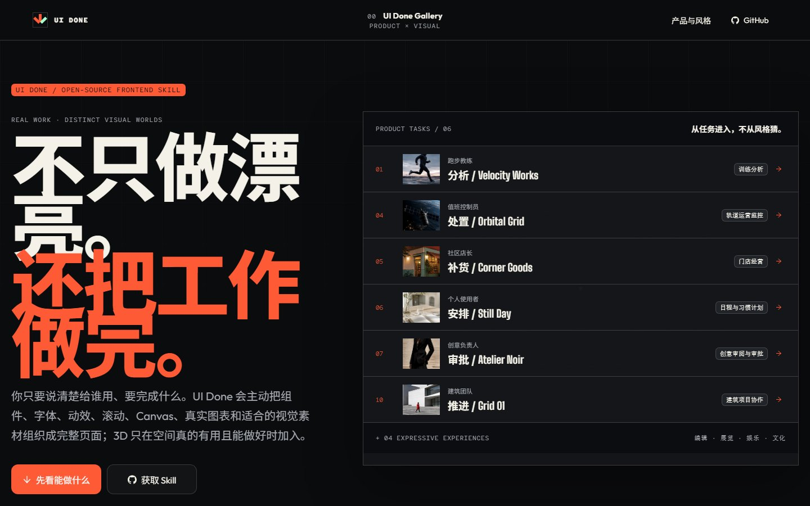
  </a>
</p>

<p align="center">
  <strong><a href="https://ww-cooooo.github.io/ui-done/showcase/gallery/">点上面的图，直接看页面展厅 →</a></strong>
</p>

展厅不再只用十套视觉皮肤证明“会做漂亮页面”。六页直接做成能完成工作的产品界面：训练复盘、航天告警处置、门店补货、日程与习惯、创意审阅、建筑项目协作；每页都有不同的使用者、核心动作、信息结构和“筛选或选择 → 查看 → 操作 → 状态反馈”闭环。另四页保留海岸编辑、当代艺术、赛博娱乐和当代新中式的完整表现力。它们不是同一个官网模板换颜色，也不是所有题材都硬改成看板。

页面共用 React、Ant Design、Anime.js、Lenis 与 Pts。六个工作产品用 AntV G2 表达当前页面里看得见的演示记录，总展厅则用路由的实际能力元数据生成比较矩阵；所有演示记录都标明 `DEMO FIXTURES`，操作只改变当前页面内存，不写入 localStorage 或 IndexedDB，也不上传，刷新即可还原。只有真正适合空间表达的 North Tide、Red Form、Orbital Grid、Neon Rift 和 Grid 01 才按需加载 Three.js / R3F，其他页面不会挂 WebGL 画布凑数。全部图片和字体都随仓库本地打包。

<details>
<summary> <strong>6 个工作产品、4 个表现页面的大图和在线链接</strong></summary>

<br>

<table>
  <tr>
    <td width="50%" align="center">
      <a href="https://ww-cooooo.github.io/ui-done/showcase/velocity-works/">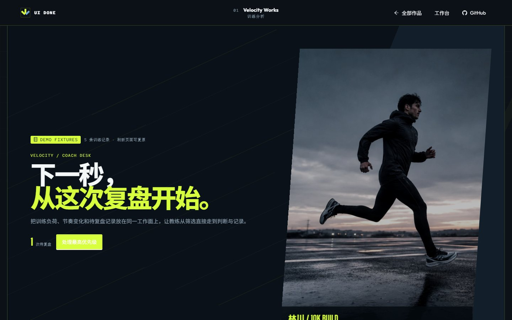</a><br>
      <strong>Velocity Works</strong><br>训练分析工作台 · 运动性能视觉 · <a href="https://ww-cooooo.github.io/ui-done/showcase/velocity-works/">打开页面</a>
    </td>
    <td width="50%" align="center">
      <a href="https://ww-cooooo.github.io/ui-done/showcase/north-tide/">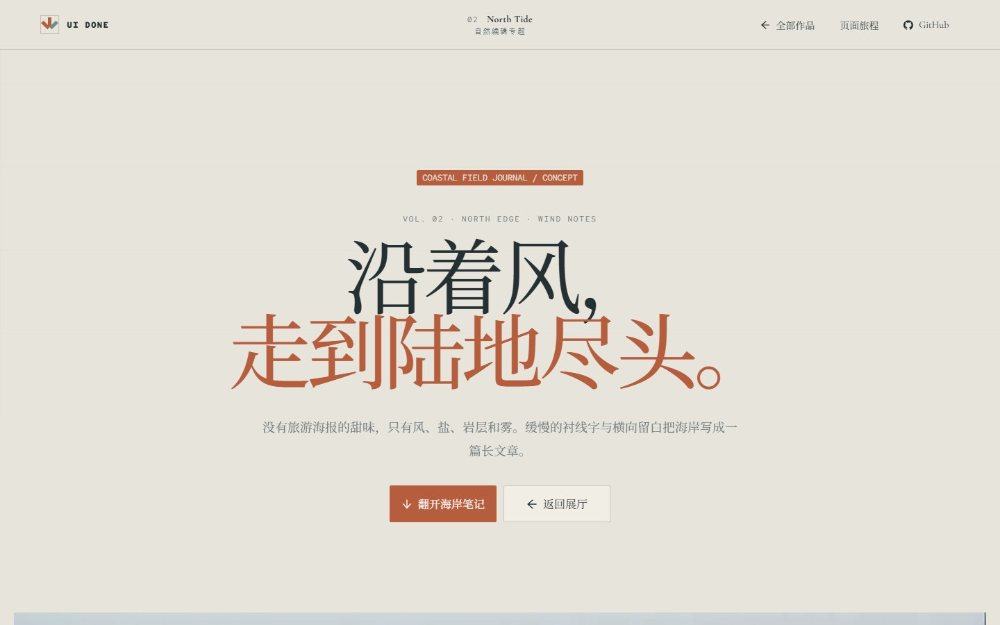</a><br>
      <strong>North Tide</strong><br>表现页面 · 海岸自然编辑 · <a href="https://ww-cooooo.github.io/ui-done/showcase/north-tide/">打开页面</a>
    </td>
  </tr>
  <tr>
    <td width="50%" align="center">
      <a href="https://ww-cooooo.github.io/ui-done/showcase/red-form/">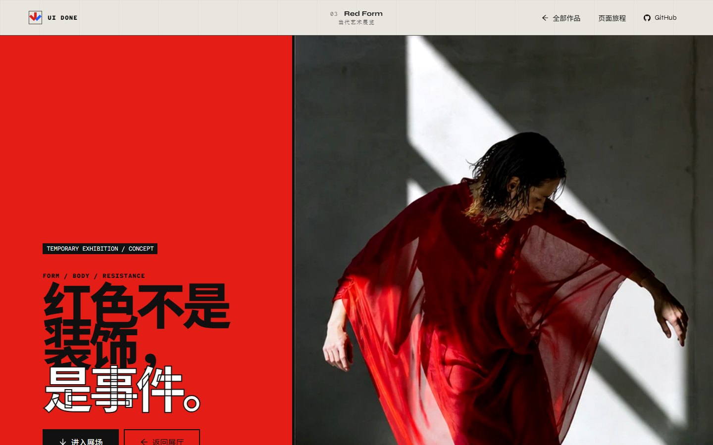</a><br>
      <strong>Red Form</strong><br>表现页面 · 当代艺术粗野主义 · <a href="https://ww-cooooo.github.io/ui-done/showcase/red-form/">打开页面</a>
    </td>
    <td width="50%" align="center">
      <a href="https://ww-cooooo.github.io/ui-done/showcase/orbital-grid/">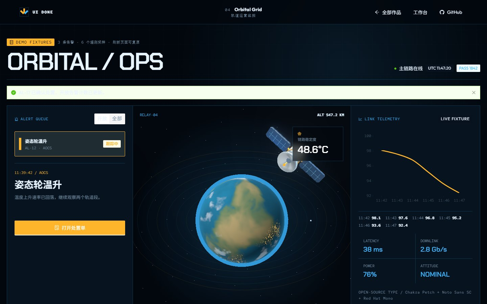</a><br>
      <strong>Orbital Grid</strong><br>轨道运营监控 · 未来航天科技 · <a href="https://ww-cooooo.github.io/ui-done/showcase/orbital-grid/">打开页面</a>
    </td>
  </tr>
  <tr>
    <td width="50%" align="center">
      <a href="https://ww-cooooo.github.io/ui-done/showcase/corner-goods/">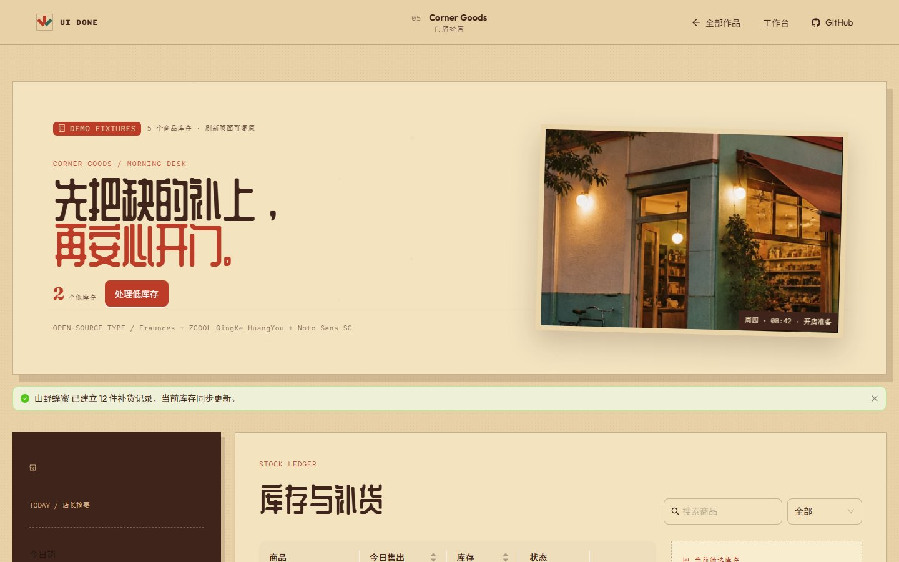</a><br>
      <strong>Corner Goods</strong><br>门店库存与补货 · 温暖复古街角 · <a href="https://ww-cooooo.github.io/ui-done/showcase/corner-goods/">打开页面</a>
    </td>
    <td width="50%" align="center">
      <a href="https://ww-cooooo.github.io/ui-done/showcase/still-day/">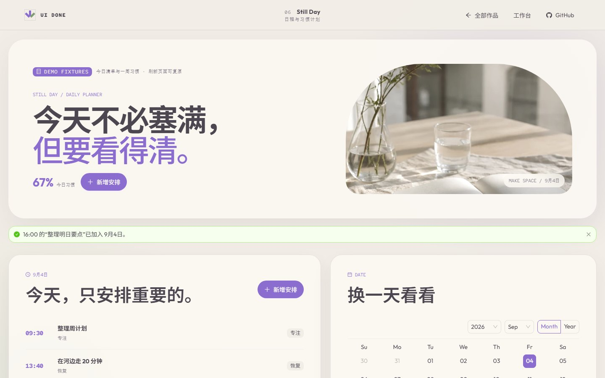</a><br>
      <strong>Still Day</strong><br>日程与习惯计划 · 柔和生活方式 · <a href="https://ww-cooooo.github.io/ui-done/showcase/still-day/">打开页面</a>
    </td>
  </tr>
  <tr>
    <td width="50%" align="center">
      <a href="https://ww-cooooo.github.io/ui-done/showcase/atelier-noir/">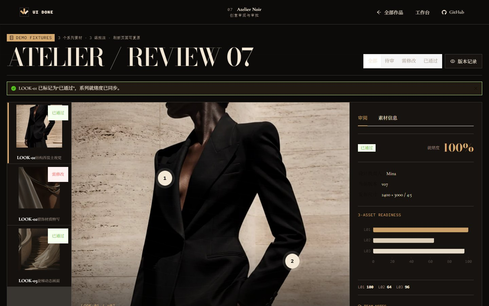</a><br>
      <strong>Atelier Noir</strong><br>创意审阅与审批 · 奢侈时装编辑 · <a href="https://ww-cooooo.github.io/ui-done/showcase/atelier-noir/">打开页面</a>
    </td>
    <td width="50%" align="center">
      <a href="https://ww-cooooo.github.io/ui-done/showcase/neon-rift/">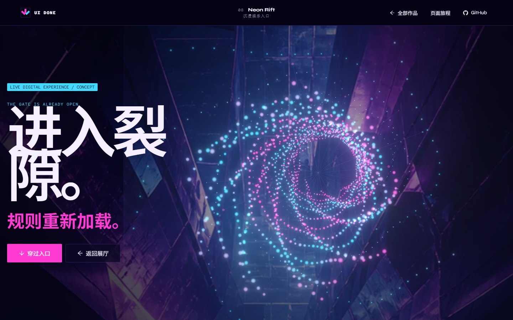</a><br>
      <strong>Neon Rift</strong><br>表现页面 · 赛博游戏与电竞 · <a href="https://ww-cooooo.github.io/ui-done/showcase/neon-rift/">打开页面</a>
    </td>
  </tr>
  <tr>
    <td width="50%" align="center">
      <a href="https://ww-cooooo.github.io/ui-done/showcase/shanshui-now/">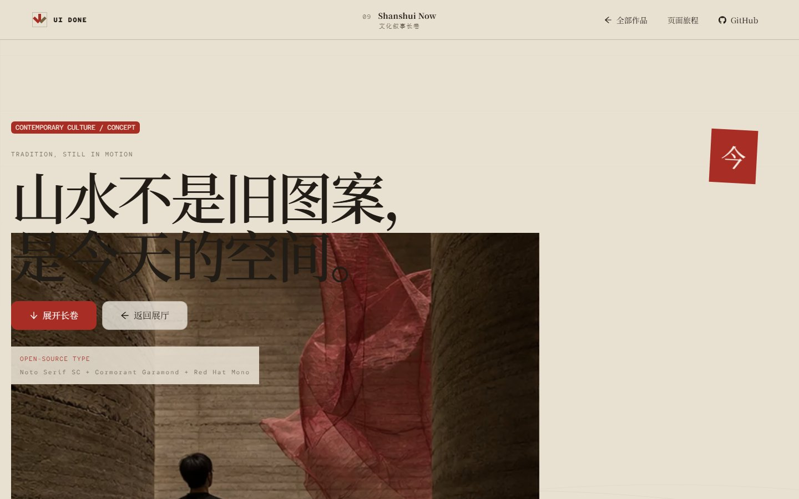</a><br>
      <strong>Shanshui Now</strong><br>表现页面 · 当代新中式 · <a href="https://ww-cooooo.github.io/ui-done/showcase/shanshui-now/">打开页面</a>
    </td>
    <td width="50%" align="center">
      <a href="https://ww-cooooo.github.io/ui-done/showcase/grid-01/">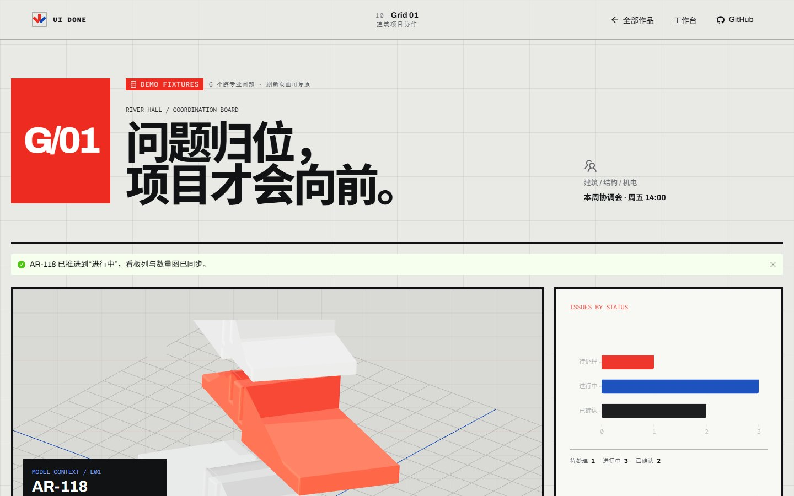</a><br>
      <strong>Grid 01</strong><br>建筑项目协作 · 瑞士国际主义 · <a href="https://ww-cooooo.github.io/ui-done/showcase/grid-01/">打开页面</a>
    </td>
  </tr>
</table>

### 这十页的任务为什么不同

| 页面 | 类型与使用者 | 核心工作或浏览目标 | 手机端怎样变化 | 3D 决定 |
| --- | --- | --- | --- | --- |
| Velocity Works | 工作产品 · 跑步教练 | 筛选训练 → 查看记录 → 写复盘 → 状态更新 | KPI 与待复盘记录优先 | 不用：趋势图和记录更清楚 |
| North Tide | 表现页面 · 自然读者 | 沿摄影与文字阅读海岸章节 | 改成单栏摄影叙事 | 使用：连续海面就是内容 |
| Red Form | 表现页面 · 展览观众 | 浏览作品、展签与策展文字 | 先看作品，再读展签 | 使用：连续雕塑就是展品 |
| Orbital Grid | 工作产品 · 值班控制员 | 筛选告警 → 查看遥测 → 确认处置 → 状态更新 | 告警与处置优先，轨道降为上下文 | 使用：轨道关系与遮挡需要空间 |
| Corner Goods | 工作产品 · 社区店长 | 找到低库存 → 填写补货 → 提交 → 库存更新 | 低库存优先，表单进入 Drawer | 不用：库存关系由表格表达 |
| Still Day | 工作产品 · 个人使用者 | 选择日期 → 完成习惯或新增安排 → 进度更新 | 今日清单优先，日历收紧 | 不用：日历与清单已经准确 |
| Atelier Noir | 工作产品 · 创意负责人 | 选择素材 → 看版本与批注 → 通过或退修 → 状态更新 | 单素材优先，历史进入 Drawer | 不用：原图细节比装饰模型重要 |
| Neon Rift | 表现页面 · 活动观众 | 沿光场与内容节奏进入活动世界 | 保留主光场，减少信息密度 | 使用：粒子隧道承担入口空间 |
| Shanshui Now | 表现页面 · 文化读者 | 顺序阅读现代山水长卷 | 单栏卷轴与图片留白 | 不用：摄影与排版已经充分 |
| Grid 01 | 工作产品 · 建筑团队 | 筛选专业 → 检查问题 → 推进状态 → 看板更新 | 一次聚焦一列，模型变为上下文 | 使用：体量与楼层定位帮助判断 |

</details>

## 它是做什么的

UI Done 不是一套固定模板。它是一份给 Agent 的工作说明，入口在 [`skill/ui-done/SKILL.md`](./skill/ui-done/SKILL.md)。无论是新做页面，还是整理一个已经写到一半的前端，Agent 都要先看清现有项目，再决定怎么改、用哪些工具、最后检查什么。

刚接触前端，可以直接从下面的示例提示开始。会写代码的话，再补上框架、目录和验收要求就行。项目越复杂，需要交代的现有接口和限制也会越多。

## 它对小白好在哪：把主动规划交给 Agent

不同前端 Skill 的定位并不一样；UI Done 不声称所有其他 Skill 都只会被动执行。它明确选择了一种更适合非专业用户的分工：不把“先写一份专业技术和设计方案”当成使用前提，而是把主动规划交给 Agent。入门时，你只要说清楚这个页面或看板给谁用、要完成什么、哪些内容不能改，以及大概希望它是什么感觉，剩下的选型、组合、实现和检查由 Agent 主动补齐；项目复杂时，再补接口、目录和交付限制。

下面比较的是“需要用户逐项点名”的执行方式与 UI Done 的默认做法，范围是完整页面、新站点或较大的改版。只改一段文字、一个间距、一个颜色值或孤立的小问题时，UI Done 会保持改动范围，不会为了凑清单给项目加一整套视觉技术。

| 事情 | 需要用户逐项点名的方式 | UI Done 的默认做法 |
| --- | --- | --- |
| 开始前要懂多少 | 用户先列出框架、组件和效果 | 用户只需说清用途、对象、限制和感觉 |
| 页面基础 | 没点名时可能只做基础控件 | 固定使用 React，并要求一个主 UI 组件系统，默认 Ant Design |
| 产品结构 | 容易把官网、看板、工具页都套进熟悉的页面骨架 | 先判断是表现页、工作产品还是合理混合；工作产品必须说清谁在用、要做什么、真实状态怎样改变，或只读任务要形成什么判断，以及最短工作闭环 |
| 视觉增强 | 动画、滚动、3D 或 Canvas 要逐项提出 | 主动为动画、Lenis 滚动和独立 2D Canvas 安排真实角色；3D 每次都评估，但只有特别合适且能做好时才采用 |
| 数据看板 | 用户先决定要不要图表、用什么图表 | 发现真实可视化对象时主动选一个主人，优先 AntV，适合时改用 ECharts，不编造数据 |
| 多页面项目 | 容易复制同一套首屏、卡片、图表和表单再换颜色 | 逐页规划产品类型、使用者、核心动作、信息结构、数据来源和手机端任务变化，再分别设计内容旅程 |
| 组件、动效、可视化或素材来源 | 知道库名才可能去找示例 | 认真比较或采用一个来源前，默认先看与当前用途相关的官方 Demo，再按整站调性改造 |
| 字体 | 没指定时容易落回浏览器或系统默认字体 | 每个新页面或较大改版都先选或确认一套与页面调性匹配、当前广泛采用且许可证明确的开源字体 |
| 图标与性能 | 容易留到最后或被漏掉 | 同时规划图标/资源和实际需要的性能手段 |
| 设备检查 | 用户逐个给出尺寸 | 能使用浏览器时，默认检查电脑、平板和手机，再按特殊要求扩展 |
| Agent 自己工作时 | 可能只在用户最初提到时生效 | 调研、增删改代码、重构、测试、打包和交付阶段都继续遵守同一套规则 |

它倾向于先把一个页面能诚实实现的产品与视觉上限做出来，而不是先交一张安全但普通的基础页面。工作界面先保证用户真能筛选、查看、操作或形成判断，并看见与真实任务一致的反馈，再把层次、动感、数据表达和合适的空间感主动做进去；表现页面则可以把图片、排版、滚动和氛围推得更大胆。你觉得还不够“花”，可以让它继续加强；觉得太炫、太动、太重，也只需要用自然语言让它收一点，不必回头补一份专业设计说明书。

主动不等于无脑堆料。每种工具仍要服务现有内容和操作，不能为了展示技术硬加栏目、假数据、无用按钮或照搬 Demo。默认能力没有自然主位置时，会先收成贴合页面的小点缀；只有遇到明确的内容、访问、安全、兼容或运行硬限制时，才允许不用。3D 是有意保留的例外：它必须先证明页面本身需要空间、材质或体积表达，而且能达到建模、性能和回退质量线，否则宁可完全不用。

这是一项有意的产品取向，不是“只评估一下、能少用就少用”：完整页面和较大改版默认要让每个必用类别至少承担一个真实角色，区别在于角色可以很小、很安静；3D 则必须通过单独的适配门槛。它更适合希望先得到丰富第一版、再逐步收敛的人；如果项目的硬要求就是零新增依赖、零动效或只用原生能力，应当一开始说清楚，这可能形成豁免，也可能意味着 UI Done 的完整改版路线并不适合该项目。

## 各 Agent 可以读取同一份规则，但不会自动拥有同样结果

- [`SKILL.md`](./skill/ui-done/SKILL.md) 是唯一权威运行契约，触发、规划、选型、编码、测试和交付规则都放在这里；README 是面向使用者的摘要，两者冲突时以完整契约为准。
- `skill/ui-done/agents/` 只保存某些宿主可选的发现适配信息，不能修改或削弱核心规则。其他 Agent 不读取这些适配文件，也不会因此丢失写在核心契约里的规则；能调用哪些工具、实际执行到什么程度，仍取决于当前宿主。
- 支持 Agent Skills 的宿主会先读取 `name` 和 `description`，匹配前端任务后再加载完整说明。宿主不支持 Skill 发现时，需要在它的项目规则、系统说明或技能注册界面中加载整个 `skill/ui-done` 文件夹；如果宿主从未看到 Skill 元数据，就不能声称已经自动触发。
- 显式调用写法由宿主决定，可能是 `$ui-done`、`/ui-done`、`@ui-done`、菜单选择或自然语言。UI Done 不把任何一家厂商的写法当成唯一入口。
- Agent 在自己调研、增删改代码、重构、调试、测试、打包或创建已授权前端子任务时，也必须重新判断是否进入前端范围；一旦进入，就持续遵守 UI Done 到交付结束。
- 任务在暂停、新会话、上下文压缩/清空或交接后恢复时，不能假定上次加载状态仍被宿主保留；继续前端工作前，必须重新读取完整 `SKILL.md`、本阶段需要的引用文件和当前任务边界。
- 前端子任务的执行者必须单独获得完整 `skill/ui-done` 文件夹及当前任务边界，不能假定它会自动继承父 Agent 已经读取的 Skill。宿主工具、上下文和更高优先级规则不同，结果可能不同；相同的是可读取的核心契约。

## 默认主动用，不等你点名

这是 UI Done 最核心的优势之一。做完整页面、新站点或较大的改版时，即使用户没有指定任何库，Agent 也会主动从下面这些类别里选择合适的主工具，并真正用进页面：

- React 和一个主 UI 组件系统，默认 Ant Design
- 动画库和平滑滚动
- 必用的独立 2D Canvas 工具，以及每次都要做、但通过严格门槛才落地的真实 3D/WebGL 评估
- 有真实数据时优先使用 AntV；当 ECharts 更适合真实数据、交互、交付或现有技术栈时改用 ECharts
- 图标、图片、字体等资源系统
- 加载、体积和运行性能工具

React 是固定框架，主 UI 组件系统默认使用 Ant Design；其他必用类别会从现有项目和素材库中选择兼容主人，例如 Anime.js、Lenis、Pts 或 Fabric.js。可视化优先 AntV，当 ECharts 更适合真实数据、交互、交付或现有技术栈时改用 ECharts。Three.js/React Three Fiber 不是装饰性打卡项：只有页面确实需要空间表达，且能做出完整质量时才会进入方案。UI Done 不会因为用户没说库名，就只交付一套最基础的页面。这对刚接触前端，或者会写一点代码、但不是专门做前端的人尤其有用：你负责说清页面给谁用、要做什么、希望是什么感觉，UI Done 负责把容易漏掉的前端选型补上。

遇到多页面站点、作品集或展示项目，它还会先做一张逐页规划表：每一页是什么产品、给谁用、核心动作是什么、信息怎样组织、哪项状态会改变、数据从哪里来、到了手机上任务怎样收拢、3D 是否真的合适。这样避免最后只得到十张不同颜色的官网，也避免为了显得“像工作软件”把所有题材都硬塞进同一种仪表盘。

确定要认真比较或采用某个组件库、动效库、可视化库或素材来源后，Agent 会先打开它的官方 Demo，查看与当前用途真正相关的示例，再按整站调性改造。不要求把无关展厅全部刷完，也不会把 Demo 的示例文字、假数据、控制栏和展示外壳原样搬进产品。3D 会先过适配门槛；门槛不通过时不会为了“看过 Demo”继续浪费调研，也不会下载 WebGL 代码。查看 Demo 不等于获得复制代码的许可；要使用示例代码或资源，仍会核对上游来源、许可证和修改记录。查看过程中也不能向第三方网站上传项目代码、内部截图、凭据或其他私密内容。

主动使用也不等于乱塞。每个工具都必须服务页面原本的内容和操作，不能为了凑技术栈硬加 3D、假图表或多余的动画开关。默认能力没有合适主位时，先收成贴合页面的小点缀；3D 没有天然主体、独特空间价值或足够完成度时，则明确记录原因并彻底不加载。采用 3D 后，穿模、自相交、闪面、镜头裁切、动画碰撞和“长方体加圆柱体硬拼模型”都属于验收失败。

## 安装

两种方式，选一种。

### 用 npx 安装

电脑里已经有 Node.js，可以运行：

```bash
npx skills add Ww-Cooooo/ui-done -g
```

这条命令会联网下载并运行当前的 `skills` 安装器；`-g` 表示安装到当前电脑的当前用户，并让所选 Agent 在不同项目中都能使用，不是给所有系统用户安装。安装程序让你选择 Agent 时，选平时使用的那个。具体写入目录、更新与移除方式由该 Agent 决定；执行前应确认目标 Agent 和目录，成功标准是它能读取完整 `SKILL.md` 与引用文件，并能告诉你显式调用方式及是否支持隐式发现。

### 把安装交给 Agent

不想处理命令行，就把这段发给 Agent：

```text
请帮我安装 UI Done：
https://github.com/Ww-Cooooo/ui-done

先读仓库根目录的 INSTALL.md，再按适合当前 Agent 的方法安装。
安装前先告诉我准备运行的命令、联网下载内容、写入目录和影响范围，等我确认后再执行。
如果已经有同名 Skill，不要直接覆盖，先问我是更新还是重装。
装好后确认完整文件可读，并告诉我安装位置、下次怎么调用、怎样更新或移除。
```

[查看完整安装说明](./INSTALL.md)

## 第一次使用

先确认当前 Agent 已经打开正确项目，并且能够读取和修改文件、运行所需命令；需要真实浏览器验收时，还要有可用的浏览器工具。普通网页聊天如果没有工作区或工具权限，只能提供规划、代码建议或审查，不能声称已经改好并验证。需要新增依赖或改变包管理器、构建配置时，由 Agent 先说明新增内容和影响，你仍不需要自己决定库名。

如果还没有项目，先新建并打开一个空文件夹，再告诉 Agent 要做什么、最终怎样交付；UI Done 会按 React 路线建立前端项目。需要账号、数据库、接口或正式上线时，把它们另外说明，不要把一张可交互的演示页误认为已经接通真实业务。

把方括号里的内容换成自己的话，然后发给 Agent：

```text
请用 UI Done 帮我【新建 / 改进】当前页面。

这个页面给【谁】使用，主要要完成【什么】。
请保留【不能改的文字、功能、数据或样式】。
我希望它看起来【例如：安静一点、像纸质杂志、信息更清楚】。

开始前先看现有项目。如果需要换框架、改变交付方式或接入付费服务，先问我。
完成后请在浏览器里检查电脑、平板和手机，并告诉我还有什么没有验证。
```

不必先学设计术语，也不用自己列一份前端工具清单。“字大一点”“再炫一点”“别太花”“像一本杂志”都能说明方向；先看第一版，再继续让 Agent 加强或收敛。有参考图或参考网站，也可以一起交给 Agent。

| 你现在的情况 | 建议再告诉 Agent 什么 |
| --- | --- |
| 刚接触 Agent 或前端 | 先用上面的提示词。遇到安装、启动或配置步骤时，让 Agent 解释清楚再继续。 |
| 会一点代码 | 加上项目框架、允许修改的目录、参考页面和不能动的文件。 |
| 经常写代码 | 直接给范围、技术边界和验收尺寸；支持 Skill 名称调用时，使用当前 Agent 支持的 `$ui-done`、`/ui-done`、`@ui-done` 或选择器。 |

## 它做事的规矩

- 先读项目说明、页面结构、现有技术栈和未提交改动，再开始写；保留用户已有修改，不能为了方便覆盖或丢弃，遇到重叠冲突先说明。
- 现有项目不是 React 时，先区分任务范围：纯文字、颜色、资源或孤立 token 小修可以保持最小改动，不借机迁移；新页面、新组件或较大改版则先说明完整迁移的范围和影响，不能偷偷混入 React 小岛。用户不批准迁移时，停止这类实施并只提供审查结果或迁移方案，不继续编写原框架的新页面。
- React 项目已经有一套被批准的主 UI 组件系统时，优先保留它；新项目或没有主人的界面默认使用 Ant Design，不能为了采用 Ant Design 再叠一套并行组件系统。
- 做完整页面或较大改版时，即使用户没有点名，也会先为 React UI、动画、滚动、独立 2D Canvas、可视化、图标和性能工具规划主方案并实际使用；可视化仅在存在真实数字、关系、时间、层级、地理或流程对象时必用，确认没有对象且不能编造数据是极少数硬性豁免。其他默认能力的省略必须有明确硬理由。真实 3D 每次都单独评估，只有天然主体、空间表达价值和成品质量预算同时成立时才采用。
- 做多页面项目时，先逐页区分表现页与工作产品，并记录使用者、核心动作、信息结构、可改变状态、数据来源和手机端任务变化；不能让不同页面重复同一套首屏、媒体卡、3D 区、图表、表单和结尾。
- 工作产品打开后要进入可辨认的工作环境，至少完成一次“筛选或选择 → 查看 → 真实操作或判断 → 可见反馈”。任务本来会修改数据时，反馈必须更新同一批记录或摘要；任务本来只读时，保留筛选、选择、比较、导航或判断上下文，不得编造审批、保存或写入成功。页面里的图表必须由同一批可见记录生成，演示数据要明确标注，手机端要保留当前任务和返回上下文的路径，不能只把电脑版从上到下堆起来。
- 每个新页面或较大改版都必须先查看候选字体的官方字样展示，选择或明确复用至少一套适合页面语言与调性的开源字体。中文、英文、数字、代码、标点和特殊符号都要覆盖；浏览器默认字体、系统字体和来源不明的“免费字体”不能作为正式设计方案。正常交付优先把字体随项目本地打包，并保留来源和许可证。
- 认真比较或采用组件库、动效库、可视化库或素材来源时，先看与当前用途相关的官方 Demo，记录采用、改造或拒绝的原因；除非存在明确的访问、安全或网络硬限制，否则不能跳过。
- 说“用 UI Done”只授权当前描述的前端任务，不自动授权账号登录、发布或其他外部操作。新增依赖或修改锁文件前，Agent 要说明包名、用途和影响；当前请求没有包含这项授权，或宿主规则要求确认时，必须等用户同意再执行。
- 不为了凑技术栈编造内容。动画跟着内容和状态走；3D 必须是特别合适的表达方式，过不了门槛就完全不用；图表只在真有数据时出现。默认能力没有合适主位，才收成贴合页面的小点缀。
- 能打开浏览器时，会用代表性的电脑、平板和手机视口检查主要操作、缺图、溢出和报错；这不等于已经在三台真实设备和所有移动浏览器上测试。检查不了的部分要写清楚。
- 发布网站、推送远端、提交真实表单、付款、发消息和删除数据，需要用户明确同意。API Key、Token、Cookie 和私钥不能写进前端页面。

<details>
<summary> <strong>给会写代码的人：技术栈、文件和检查命令</strong></summary>

<br>

当前仓库展厅是 UI Done 的一套参考实现。总入口和十个作品都是 React 页面，共享生命周期、故障回退和构建基础设施；六个工作产品各有不同的角色、任务、信息架构和可更新状态，四个表现页面各有不同的阅读旅程。十个作品中只有五个通过 3D 适配门槛，另外五个作品和总入口不加载 WebGL。六个工作产品的 AntV 图表来自当前页可见的演示记录，总展厅的能力矩阵来自十个路由的实际实现元数据；四个表现页面没有为了凑看板而编造数据。下表版本是本仓库展厅锁定的实现版本，不是 UI Done 强迫所有业务项目使用的固定版本，也不保证另一宿主必然复现相同成品。

| 工作 | 示例展厅选用 |
| --- | --- |
| 页面主体与交互 | React 19 + Ant Design 6；按钮、Table、Drawer、Form、Calendar、Modal、卡片、标签与主题 token 都由同一组件系统负责 |
| 动画 | Anime.js 4；负责首屏编排、滚动进入与状态连续性，降低动效时切成静态完成态 |
| 平滑滚动 | Lenis 1；三种设备共用同一滚动机制，并保留锚点、历史返回、键盘和 Ant Design 浮层；工作内容本身仍按电脑、平板和手机重新组织 |
| 条件式真实 3D/WebGL | Three.js + React Three Fiber；只在 North Tide 的连续海面、Red Form 的一体化雕塑、Orbital Grid 的地球与完整卫星、Neon Rift 的粒子隧道、Grid 01 的分层折板建筑中按需加载。每个场景都检查多帧构图、穿模/闪面/裁切、结构连接和回退；其他页面不请求 3D 分块 |
| 独立 2D Canvas | Pts；嵌入已有内容区，分别承担速度轨迹、轨道参考、库存颗粒、计划涟漪、面料曲线、建筑网格或表现页氛围，不另造 Demo 区；与 3D 生命周期分开，2D context 不可用时不阻断正文 |
| 数据可视化 | AntV G2；六个工作产品把页面内演示记录汇总为趋势、数量或就绪度图，总展厅把路由能力元数据画成矩阵；都保留可读数字或表格作为等价内容 |
| 图标与字体 | Ant Design Icons 按需导入；12 套 OFL-1.1 开源字体按十种调性配对，中文子集和全部字体均本地打包 |
| 性能 | React lazy、Vite 分块、离屏/隐藏暂停、高级层故障回退和 Size Limit |
| 构建 | Vite 8；生成相对资源路径、第三方许可证汇总和入口内容哈希 |

常用入口：

- [`skill/ui-done/SKILL.md`](./skill/ui-done/SKILL.md)：Skill 本体
- [`skill/ui-done/references/`](./skill/ui-done/references/)：选型、字体、动效和浏览器检查
- [`skill/ui-done/scripts/`](./skill/ui-done/scripts/)：静态预检脚本
- [`showcase/`](./showcase/)：总展厅、十个独立作品和共享 React 运行时

直接看[在线展厅](https://ww-cooooo.github.io/ui-done/showcase/gallery/)不需要本地环境。克隆仓库后查看已经构建好的本地版本，也不需要 Node.js 或 pnpm，但 ES module 需要通过本地 HTTP 服务打开，不能直接双击 HTML。进入仓库根目录，Windows 运行 `python -m http.server 4173 --bind 127.0.0.1`，macOS/Linux 运行 `python3 -m http.server 4173 --bind 127.0.0.1`，再打开 `http://127.0.0.1:4173/showcase/gallery/`；也可以换用自己已有的静态文件服务器。

要从源码重建展厅，需要 Node.js `^20.19.0` 或 `>=22.12.0`、pnpm `11.19.0`，以及用于静态预检的 Python 3.10 或更高版本。先进入克隆后的仓库根目录，再按系统运行：

Windows PowerShell：

```powershell
pnpm install --frozen-lockfile
python .\skill\ui-done\scripts\frontend_preflight.py .\showcase --offline
pnpm run check
```

macOS 或 Linux：

```bash
pnpm install --frozen-lockfile
python3 ./skill/ui-done/scripts/frontend_preflight.py ./showcase --offline
pnpm run check
```

先用 `node --version`、`pnpm --version` 和 `python --version`（macOS/Linux 通常为 `python3 --version`）确认版本；缺少 pnpm 时，按 pnpm 的官方安装方式启用上面锁定的版本。`pnpm run check` 会重新构建展厅、生成第三方声明与入口指纹，并检查 JavaScript 和 CSS 体积预算；浏览器交互与三种视口仍需要另行实测。

本仓库参考实现于 2026-09-04 使用本地静态 HTTP 入口和 Chromium 完成 11 个路由 × 电脑、平板、手机三个代表性视口，共 33 次检查；六个工作闭环、外部请求、缺图、控制台错误、横向溢出、字体加载、减弱动态与无 WebGL 回退均未发现失败。这里的“手机、平板”指浏览器视口，不是真机或所有浏览器保证，也不代表任意 Agent 宿主会自动复现同样结果。

</details>

## 开源、反馈和安全

项目自己编写的 Skill、脚本、文档和示例页面代码使用 [MIT License](./LICENSE)。安装或使用中遇到问题，可以打开[问题反馈表单](https://github.com/Ww-Cooooo/ui-done/issues/new?template=problem.yml)；涉及密钥、权限或可疑命令时，请按[安全说明](./SECURITY.md)私下报告。

仓库里的第三方依赖、字体和示例图片有各自的许可或来源说明，不能全部按项目的 MIT License 处理。

<details>
<summary> <strong>第三方资源：完整声明</strong></summary>

<br>

- React、Ant Design、Ant Design Icons、Anime.js、Lenis、Three.js、React Three Fiber、React Three Postprocessing、Postprocessing、Pts、AntV G2 等示例运行时依赖使用各自的 MIT、Zlib、Apache-2.0、0BSD 或 ISC 许可。精确版本、版权文字和完整许可证随打包文件保存在 [`showcase/shared/runtime/THIRD_PARTY_LICENSES.txt`](./showcase/shared/runtime/THIRD_PARTY_LICENSES.txt)。
- Outfit、Big Shoulders、Noto、Cormorant、Syne、Fraunces、Bodoni Moda、Chakra Petch、Archivo、ZCOOL 和 Red Hat Mono 等字体使用 SIL Open Font License 1.1，原作者版权声明、中文子集来源清单和许可证文件保留在仓库中。
- 展厅的 30 张 WebP 主视觉由图像生成工具为本仓库创建，不是第三方图库素材；提示方向、处理方式和内容边界见 [`showcase/assets/IMAGE_NOTICES.md`](./showcase/assets/IMAGE_NOTICES.md)。
- 文件清单、哈希、来源、作者声明和适用范围见 [`THIRD_PARTY_NOTICES.md`](./THIRD_PARTY_NOTICES.md)。再分发仓库或打包后的示例时，请一并保留适用的声明和许可证。

</details>
