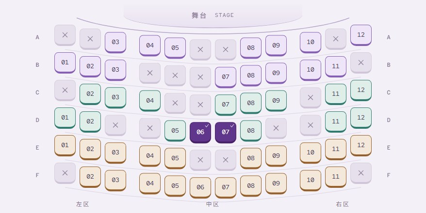

<div align="center">

# UI Done

**UI Done 是一套给 AI Agent 使用的前端设计与开发规则。你需要说清页面给谁用、要解决什么问题、手头有哪些真实内容、哪些内容不能改、最后要交付到哪里，以及你希望页面给人什么感觉。Agent 会继续补全页面结构、组件、字体、动效和检查流程，并在工具允许时把页面真正做出来。**

UI Done 采用开放的 [Agent Skills](https://agentskills.io/) 文件格式，不绑定某一家 AI 厂商。能够读取这种 Skill 的 Agent 可以使用它；不能自动发现 Skill 的 Agent，也可以把完整规则文件夹加载到项目说明或系统说明中。

这里所说的 **Agent**，是能够打开项目、修改文件和运行工具的 AI 助手。**Skill** 是一组让 Agent 在执行任务时遵守的规则文件。

[在线查看示例展厅](https://ww-cooooo.github.io/ui-done/showcase/gallery/) · [安装 UI Done](#一分钟安装) · [阅读完整安装说明](./INSTALL.md) · [查看许可证](./LICENSE)

</div>

<p align="center">
  <a href="https://ww-cooooo.github.io/ui-done/showcase/gallery/">
    
  </a>
</p>

UI Done 不是一套固定模板，也不是一个点一下就能生成网站的独立软件。它是一份供 Agent 在调研、设计、写代码、修改代码、测试和交付时持续遵守的工作规则。它只负责当前任务里的前端部分，不会自动获得你的账号权限，也不会凭空提供后端、真实业务数据或发布服务。

要让 Agent 直接修改本地项目，它至少需要能够打开正确的项目目录、读写文件和运行必要命令。要让它完成浏览器检查，还需要可用的浏览器工具。只有聊天窗口、没有这些工具和权限时，Agent 可以解释、审查或提供代码建议，但不能声称已经在你的项目里改好并验证。

> [!IMPORTANT]
> 新页面、新组件和较大的视觉改版必须使用 React。新项目或没有既定主组件系统的 React 项目默认使用 Ant Design。已有非 React 项目如果只需要修改一段文字、一个颜色或一张图片，可以保持原来的技术方案和改动范围；如果要继续新增页面、组件或进行大改，Agent 必须先向你说明完整迁移的范围和影响，并在得到你的同意后再实施。UI Done 不允许在原项目里偷偷加入一个与现有框架并存的 React 小页面。

## 一分钟安装

电脑已经安装 Node.js 时，可以运行：

```bash
npx skills add Ww-Cooooo/ui-done -g
```

这条命令会联网下载并运行第三方的 `skills` 安装器。`-g` 表示把 Skill 安装到当前电脑的当前用户范围，并不表示给这台电脑上的所有用户安装。安装器会让你选择要使用 UI Done 的 Agent；请确认它最终能够读取完整的 `skill/ui-done` 文件夹，而不只是单独复制一份 `SKILL.md`。

`skills` 安装器的[官方说明](https://www.skills.sh/docs/cli)写明，它默认会收集匿名使用统计，也提供 `DISABLE_TELEMETRY=1` 关闭方式。这是安装器自己的行为，不是 UI Done 页面代码在收集数据。

如果不希望本次安装发送匿名使用统计，可以改用下面的命令。Windows PowerShell 中，这个设置只对当前终端窗口生效：

```powershell
$env:DISABLE_TELEMETRY = "1"
npx skills add Ww-Cooooo/ui-done -g
```

macOS 或 Linux：

```bash
DISABLE_TELEMETRY=1 npx skills add Ww-Cooooo/ui-done -g
```

如果你不想自己运行命令，可以把下面这段完整地发给 Agent：

```text
请帮我安装 UI Done：
https://github.com/Ww-Cooooo/ui-done

请先阅读仓库根目录的 INSTALL.md，再选择适合当前 Agent 的安装方法。
安装前请告诉我准备运行什么命令、会从网络下载什么内容、会写入哪个目录，以及会影响哪些现有文件。等我确认后再执行。
如果已经存在同名 Skill，请不要直接覆盖，先问我是更新还是重新安装。
安装完成后，请确认整个 skill/ui-done 文件夹都能读取，并告诉我以后怎样调用、更新和移除它。
```

不同 Agent 的安装目录和显式调用方法可能不同。更完整的判断方法和手动安装步骤见 [INSTALL.md](./INSTALL.md)。

安装成功至少要满足四件事：Agent 能告诉你 UI Done 的实际安装目录，能打开 `SKILL.md`，能继续读取同目录下的 `references` 文件，并能告诉你当前平台支持哪种显式调用方式以及是否支持自动发现。如果其中任何一项无法确认，就不要把安装当成已经完成。

上面的 `npx` 命令会安装仓库默认分支上的当前版本，适合个人快速试用。团队需要固定、审查和重复安装同一版本时，不应依赖会继续变化的默认分支。团队应先选定已经审阅的发布标签或提交，把该版本的完整 `skill/ui-done` 文件夹保存到团队管理的位置，记录仓库地址、版本号或提交号、文件哈希和更新方法，再按所用 Agent 的官方说明注册这份固定副本。UI Done 目前没有承诺一条适用于所有 Agent 的统一团队安装命令。

## 第一次使用时应该怎么说

你不需要先学会设计术语，也不需要自己列出 React、组件库、动效库和图表库。把方括号里的内容换成自己的话，然后发给已经安装 UI Done 的 Agent：

```text
请使用 UI Done 帮我【新建 / 改进】当前页面。

这个页面主要给【谁】使用，他们需要在页面里完成【什么事情】。
我能提供的真实文字、数据、图片和品牌素材是【列出已有内容；没有的部分请明确告诉我，不要自行编造】。
请保留【不能修改的文字、功能、数据、网址或视觉元素】。
我希望页面给人的感觉是【例如：安静、专业、像纸质杂志，或者科技感更强】。
最终请把成果交付到【当前项目目录 / 新项目目录 / 其他明确位置】。

开始前请先检查现有项目。如果需要更换框架、改变交付方式、安装新的依赖或接入付费服务，请先向我说明原因和影响。
完成后请在浏览器里检查电脑、平板和手机尺寸，并明确告诉我哪些内容已经验证，哪些内容还没有验证。
```

“字体大一点”“信息太挤”“我想要更有科技感”“不要做成普通后台”都是可以理解的要求。有参考图片或参考网站时，也可以一起发给 Agent。如果你要求开发或改版，“第一版”指在已授权范围内写入项目并完成能做的浏览器检查，而不只是给一张效果图；如果你只要求审查，Agent 就只能报告问题，不能擅自改代码。

| 你负责说明 | Agent 使用 UI Done 后负责补全 |
| --- | --- |
| 页面给谁使用，以及他们真正要完成什么事情。 | 判断页面应该是工作工具、表达型页面，还是两者合理结合。 |
| 哪些内容、功能、数据和文件不能修改。 | 检查现有项目，选择页面结构、主组件系统和适合当前内容的实现方法。 |
| 你希望页面呈现什么感觉，以及你不喜欢什么。 | 选择有明确许可证的开源字体，并规划图片、图标、动效、滚动、Canvas 和数据表达。 |
| 需要交付到哪里，以及是否允许安装依赖或发布。 | 编写代码，检查主要交互、不同屏幕尺寸、减弱动态模式、性能，以及高级效果无法加载时的替代显示。 |

## 它比“只按用户清单做页面”多做了什么

有些工作方式要求用户先指定框架、组件、字体、图表和动画，Agent 才会逐项实现。UI Done 选择了更主动的分工：用户负责说清真实需求和限制，Agent 负责主动寻找能改善页面的前端能力，并说明每项能力为什么适合当前页面。

这种主动不等于把所有库都堆进项目。一个只改错别字的小任务应该保持很小；一个完整页面或较大的改版则不能因为用户没有点名动效、字体或数据可视化，就交付一张只有基础控件的普通页面。每项能力都必须服务真实内容和操作，不能为了展示技术而编造栏目、假数据、无用按钮或装饰性 3D。

## 完整页面会主动使用哪些前端能力

React 和主 UI 组件系统的要求适用于所有新增的应用代码和可见组件。下表中的完整能力规划适用于新建一个可使用的完整页面、新建站点，或明显改变页面信息结构、主要操作流程和视觉系统的大改。只修改一段文字、一个颜色、一张图片或一个现有样式变量，且不增加新的应用代码，属于孤立小修。你不需要自己判断任务属于哪一类；Agent 检查项目后要告诉你判断结果和理由。

开始写代码前，Agent 要先为下表中的每一类能力安排至少一个真实用途。除了需要单独判断是否适合的 3D，以及“没有真实可视化对象并且不能编造数据”的极少数图表豁免，Agent 不能因为嫌麻烦就省略某一类能力。如果一项能力不适合占据主要位置，它可以在现有内容中承担一个小而合理的辅助作用。只有交付格式、许可证、无障碍、安全、性能、兼容性或实际运行失败等问题，在尝试缩小用途、更换兼容方案和准备替代显示后仍然无法解决，才可以省略其他默认能力；Agent 必须记录试过什么和最后保留了什么。

“页面没有给这项能力安排主要位置”本身不是省略 Lenis 或 2D Canvas 的理由。Agent 应先尝试把它缩成现有内容中的小型辅助效果，而且这个效果不能增加假数据、假操作或新的产品含义。如果项目明确要求零平滑滚动、零 Canvas 或零新增依赖，应在开始前说明；这可能形成有证据的限制，也可能意味着 UI Done 的完整改版路线不适合这个项目。

| 类别 | UI Done 要求 Agent 怎样处理 |
| --- | --- |
| React | 新页面、新组件和较大改版固定使用 React。已有非 React 项目需要先规划一次完整、可回退的 React 迁移，不能让两个前端框架在同一产品里偷偷并存。用户不批准迁移时，Agent 应当停止这类实施，只提供审查结果或迁移方案。 |
| 主 UI 组件系统 | 页面必须有一套主组件系统。新项目或没有既定组件系统的项目默认使用 Ant Design；只有现有 React 产品已经明确采用另一套主系统，或者 Ant Design 存在无法解决的兼容、许可、无障碍或交付限制时，才改用另一套成熟的 React 系统，并写明理由。按钮、输入框、表单、选择器和提示等可见控件要真正使用这套系统，不能只安装依赖却继续手写一套平行控件。 |
| 开源字体 | 每个新页面或较大改版都要查看候选字体的正式字样展示，并选择与页面语言和气质匹配、当前仍在维护、有较多人使用且许可证明确的开源字体。中文、英文、数字、代码符号、标点和特殊字符都要实际检查；正式交付优先把字体放在项目本地。 |
| 页面动效 | 新页面和较大改版默认使用 GSAP 与 `@gsap/react`。Agent 要先查看 GSAP 官方 React 指南和一个与当前页面任务相关的真实演示，再让 GSAP 负责这个页面自己的主要动效。多个页面不能只换颜色和文字，却继续共用同一种淡入、位移或滚动进入。页面还要支持“减弱动态”偏好；动画减少或关闭后，内容和操作必须完整。 |
| 平滑滚动 | 完整页面默认使用 Lenis，并由它单独负责滚动手感；需要滚动编排时由 GSAP ScrollTrigger 负责触发和时间关系，不能同时加入 GSAP ScrollSmoother。页面仍要保留锚点、键盘焦点、浏览器历史、触摸滚动和组件浮层的正常行为。如果调整作用范围和参数后仍会破坏这些操作，或者在目标设备上造成无法接受的卡顿，才可以退回原生滚动。 |
| 独立 2D Canvas | 完整页面默认让 Pts、Fabric.js 等 2D Canvas 工具承担一个真实而独立的视觉角色。它可以很克制，但不能只是为了证明“用过 Canvas”而额外制造一个无关演示区。 |
| 数据可视化 | 页面存在会帮助用户比较、判断或完成任务的真实数字、变化趋势、关系、层级、地理位置或流程状态时，必须使用 AntV 或 ECharts，默认先考虑 AntV。页脚日期、导航层级或一段静态步骤本身不算可视化对象。两者只选择一种，不能为了显得丰富而同时加入。如果页面确实没有可视化对象，而且又不能编造数据，才允许不放图表。图表必须来自页面正在显示的同一批数据，并提供可读的数字、文字或表格作为等价内容。 |
| 真实 3D / WebGL | 每次都要评估 3D 是否适合，只有下面四个条件全部满足时，才使用 Three.js 或 React Three Fiber：页面已经有一个真实对象或空间关系承载它；内容的重点确实是材质、体积、深度或空间运动；3D 比图片、视频、普通页面元素或 2D Canvas 表达得更清楚；团队有能力完成模型、灯光、材质、动画、不同设备性能和无法运行时的替代显示。只要有一项不满足，就记录原因并完全不加载 3D。穿模、闪面、镜头裁切和简单几何体生硬拼接都算失败。 |
| 图标与图片 | Agent 要为界面选择一套一致的图标系统；只有内容或视觉方向确实需要图片时，才选择图片，不能为了填满版面加入无关素材。所有采用的图片都要核对来源、清晰度、裁切、加载失败状态和使用许可。不能用表情符号或来源不明的素材代替正式视觉系统。 |
| 性能与设备检查 | Agent 要按实际需要使用懒加载、分块、离屏暂停、资源压缩，以及高级效果加载失败时的替代内容，并在工具允许时检查电脑、平板和手机的代表性尺寸。这里的浏览器视口检查不等于在所有真实设备和浏览器上都测试过。 |

UI Done 不会因为“完整”就自动加入服务端渲染（SSR）、组件测试体系、国际化或从右向左排版（RTL）。主题模式、路由、数据请求、状态管理和表单也只在当前 React 项目真正需要时使用。它要求 Agent 把设计和实现想完整，同时要求工程方案保持精简。

UI Done 对“不使用 GSAP”的限制很严格。只改文字、颜色、图片或现有样式变量，而且完全不涉及动效时，不需要为了这次小修改安装 GSAP。其他情况下，只有用户明确禁止、项目已有动画方案而本次没有迁移授权、GSAP 的许可证不适合当前产品，或者兼容性、无障碍、性能与运行问题在缩小用途并准备静态替代后仍然存在，Agent 才能不用 GSAP。Agent 必须写明是哪一条限制、验证了什么、最后保留了什么。“CSS 也能做”“少装一个依赖”“时间不够”都不能算理由。

## Agent 必须先看真实示例，再决定怎样实现

新页面或较大的视觉改版要做两次互不替代的查看。第一步是查看 [GSAP React 指南](https://gsap.com/resources/React/)和 [GSAP Demo Hub](https://demos.gsap.com/)或 [Showcase](https://gsap.com/showcase/)中与当前任务最接近的演示，用来确定 GSAP 在页面里具体负责什么。第二步是完成下面的“五源创意勘察”。Agent 必须查看与当前任务相关的真实演示和代码，再决定采用、改造、只吸收思路，还是因为明确原因拒绝。五个来源不需要全部装进项目，但不能在没有查看的情况下凭印象跳过。

| 来源 | Agent 要完成的动作 |
| --- | --- |
| [MotionSites](https://motionsites.ai/) | 选择一个与页面整体风格相关的设计方向；网站允许时，复制一份公开的设计提示词（Prompt）作为研究输入。 |
| [React Bits](https://reactbits.dev/) | 选择一个相关 React 组件，同时查看实际效果和代码结构。 |
| [Uiverse](https://uiverse.io/) | 选择一个适合当前页面的局部 UI，同时查看它的实际代码。 |
| [Anime.js](https://animejs.com/) | 查看与当前内容或交互相符的演示和 API，用它比较另一种动画表达。GSAP 已经负责页面动效时，Anime.js 通常只记录为思路来源或不采用，不能再控制同一元素、时间线或滚动区域。 |
| [Aceternity UI](https://ui.aceternity.com/) | 选择一个相关组件或页面结构，同时查看预览和代码。 |

查看示例不代表可以直接复制。Agent 还要核对许可证、依赖、性能和再分发条件，删除演示文字、假数据、远程图片和无关控制栏，再把真正采用的部分改成符合当前页面的内容和视觉语言。它也不能把你的内部代码、截图、凭据或私密数据上传给这些网站。

五源调研需要联网，第三方网站会像普通网页访问一样看到网络地址和浏览器信息。默认情况下，Agent 不能使用浏览器里已经登录的第三方账号；它应当改用未登录的浏览器环境，或者先取得用户对这次账号访问的明确同意。只有用户明确允许使用现有登录状态后，网站才可以收到相应的登录 Cookie。Agent 也不能为了调研自行登录账号。如果用户禁止联网、网络不可用、页面在有限次数的安全尝试后仍无法访问、只允许使用未经授权的登录状态，或只能通过不安全的方式运行，Agent 要记录原因并说明没有完成当前演示核对，不能假装已经看过。这样的硬性原因只豁免无法查看的来源，不会自动停止整个前端任务；Agent 应继续查看其余可访问来源和素材库，也不能采用无法核对的代码或提示词。如果一个关键选择只能依赖无法访问的来源，Agent 应改选有证据的方案，或者暂停这个选择并询问用户。

素材库还包括 [GSAP](https://gsap.com/)、[GSAP 官方 Agent Skills](https://github.com/greensock/gsap-skills)、[Ant Design](https://ant.design/)、[AntV](https://antv.antgroup.com/)、[ECharts](https://echarts.apache.org/zh/index.html)、[Pts](https://github.com/williamngan/pts)、[Fabric.js](https://github.com/fabricjs/fabric.js)、[p2.js](https://github.com/schteppe/p2.js#demos)、[Element Plus](https://github.com/element-plus/element-plus) 和 [background-effects](https://mofeiss.github.io/background-effects/index.html)。GSAP 运行时使用 Webflow/GreenSock Standard “No Charge” License，不是 MIT。官方 Agent Skills 仓库本身使用 MIT License；这两个许可证不能混为一谈。UI Done 可以参考该仓库，但不能依赖用户额外安装它才会正常工作。

Agent 在提出清单之外的第三方库或浏览器原生实现之前，必须先查这个素材库。如果素材库确实没有合适的方案，Agent 要写明缺少的能力，再选择现有 React 方案、另一个经过核对的开源库，或浏览器原生能力。当前素材库没有预先指定登录和身份验证、主题、路由、数据请求、跨组件共享的页面状态、表单、品牌专用图标和性能分析工具；这些能力只在项目真正需要时另行选择。Element Plus 只作为 Vue 组件设计的参考来源，UI Done 的新页面实现仍固定使用 React。

## 多个页面不能只是换颜色和图片

多页面站点可以共用路由、数据、无障碍支持、高级效果失败时的替代内容和构建配置，因为这些内容通常不会直接决定页面长什么样。每个页面的可见结构则要分别设计，包括开场方式、主要内容形状、导航位置、详情怎样出现、滚动方向、主要动效、结束方式和手机端变化。

普通的多页面项目仍然要避免让不同任务共用同一组页面骨架、详情方式、滚动方式和主要动效；如果真实任务相同，可以说明理由后保留必要的产品导航。只有用户明确说“每个页面都不同”“不能有任何相同布局”或同等要求时，才进入下面的严格模式。在严格模式下，任意两个页面都不能共用同一个可见页头、导航位置、主要内容比例、主轴、详情容器、控制区、进度样式、媒体比例、入场动效、滚动方向或手机端重排方式。

1. Agent 先为每个页面画出不带颜色、文字和图片的结构草图。
2. Agent 再把每两个页面放在一起，比较主轴、内容比例、操作位置、详情容器、滚动方式和动效触发。
3. 如果隐藏标题、颜色、图片和装饰后，任意两页仍然能套进同一张结构草图，它们就是同一种布局，必须重做。“左边窄栏、中间大块、右边窄栏”只是一个典型例子，不是唯一需要拦截的重复形式。
4. 严格模式下，同一种抽屉、弹窗、大图长页、卡片阵列或统一淡入不能在第二个页面再次成为主要结构。Ant Design 的底层组件可以继续复用，但组合出来的可见页面不能复用同一张结构图。

这些结构草图和逐页比较结果要保留在工作记录中。完成后，Agent 还要用浏览器截图或可见页面状态再次比较电脑和手机布局，并在交付说明中告诉用户哪些重复已经排除。

当用户要求全量重构时，旧页面只用于确认真实内容、现有功能、缺陷和回滚边界，不能继续充当新布局的拼装模板。只有用户明确要求保留，或者确实存在产品理由时，Agent 才能延续旧构图。

## UI Done 会在 Agent 的整个工作过程中继续生效

UI Done 不是只在用户第一次说“帮我做页面”时出现一次。只要任务仍然涉及前端，Agent 在收集资料、增加代码、修改代码、删除代码、重构、调试、测试、打包和交付时都要继续遵守它。

下面所说的“宿主”，就是运行 Agent 的应用或平台。

- [`skill/ui-done/SKILL.md`](./skill/ui-done/SKILL.md) 是完整运行规则。README 只是给使用者看的说明；两者出现差异时，应以 `SKILL.md` 为准。
- 团队准备把 UI Done 加入正式开发流程时，应当一并审阅 `SKILL.md` 和它实际引用的规则文件。只批准这份 README，不能代替对完整运行规则的审查。
- 能够识别 Agent Skills 的宿主通常会先读取 Skill 的名称和描述，再在命中前端任务后加载完整规则。宿主不支持自动发现时，需要把整个 `skill/ui-done` 文件夹放进它能够读取的项目规则、系统说明或技能注册位置。
- 显式调用方式由宿主决定，可能是 `$ui-done`、`/ui-done`、`@ui-done`、菜单选择或自然语言。UI Done 不把任何一家厂商的调用格式当成唯一标准。
- 任务暂停后重新开始，或者经过新会话、上下文压缩、上下文清空和 Agent 交接后，继续做前端之前必须重新读取完整 `SKILL.md`、当前阶段需要的引用文件和任务边界。
- 如果 Agent 把前端工作交给另一个执行者，必须把完整的 `skill/ui-done` 文件夹和当前任务边界一并交给它。不能假定新的执行者会自动继承上一个 Agent 已经读取的规则。
- 不同 Agent 拥有的工具和权限可能不同，所以同一份 Skill 不能保证它们产出完全相同的页面。只有在宿主确实读到了 Skill 文件，并且具备修改和测试项目的工具时，才能声称 UI Done 已经被实际执行。

## 这 12 个页面展示了什么

本仓库的展厅包含 7 个工作型页面、4 个表达型页面和 1 个动效试验页。七个工作型页面分别处理训练复盘、航天告警、门店补货、日程习惯、创意审阅、建筑协作和剧场选座；四个表达型页面分别探索海岸编辑、当代艺术、赛博娱乐和当代新中式。动效试验页让使用者直接操作任务重排、滚动组装和路径缓动，观察 GSAP 怎样处理真实界面状态，而不是只看一段自动播放的装饰动画。

原有十个作品分别采用训练数据工作区、轨道驾驶舱、连续小票、七天日程、照片裁切审阅台、无限蓝图、全屏章节、单一展览舞台、传送门状态机和横向长卷。它们尝试用不同结构服务不同任务，而不只是更换颜色和图片。第十一个动效试验页从上到下排列任务重排、滚动组装和路径缓动三个实验，也可以通过页首入口直接跳到其中一项。展厅里的预览卡片把三个效果串在一条斜向路径上；这张卡片的构图与实验详情页不同。

新增的“回声小剧场”以扇形座位图为中心。观众先选择人数和票区，再手动选座或推荐连座；所选座位显示在票根中，金额随选择更新，确认结果也留在原页。手机可以切换左、中、右三个座位区，不会把整个剧场缩成难以点击的小点。演出和库存均为虚构演示，确认不会锁座、扣款或创建真实订单。

工作型页面使用的是随页面提供的演示记录，操作只改变当前页面运行时的 React 状态。当前示例源码没有连接业务接口，也不把这些记录写入 localStorage、sessionStorage 或 IndexedDB；刷新页面后，内容会恢复到初始状态。Corner Goods 页面里的操作不会真的向供应商发送消息，其他页面也不会把演示操作伪装成已经完成的外部业务。

<details>
<summary> <strong>查看 12 个页面的说明和链接</strong></summary>

<br>

<table>
  <tr>
    <td width="50%" align="center">
      <a href="https://ww-cooooo.github.io/ui-done/showcase/velocity-works/"></a><br>
      <strong>Velocity Works</strong><br>工作型页面：跑步教练可以选择训练、比较负荷、填写复盘并完成记录。<br><a href="https://ww-cooooo.github.io/ui-done/showcase/velocity-works/">打开页面</a>
    </td>
    <td width="50%" align="center">
      <a href="https://ww-cooooo.github.io/ui-done/showcase/north-tide/"></a><br>
      <strong>North Tide</strong><br>表达型页面：旅行与自然读者可以逐章浏览海岸摄影和文字。<br><a href="https://ww-cooooo.github.io/ui-done/showcase/north-tide/">打开页面</a>
    </td>
  </tr>
  <tr>
    <td width="50%" align="center">
      <a href="https://ww-cooooo.github.io/ui-done/showcase/red-form/"></a><br>
      <strong>Red Form</strong><br>表达型页面：展览观众可以在四个展室之间切换作品和策展文字。<br><a href="https://ww-cooooo.github.io/ui-done/showcase/red-form/">打开页面</a>
    </td>
    <td width="50%" align="center">
      <a href="https://ww-cooooo.github.io/ui-done/showcase/orbital-grid/"></a><br>
      <strong>Orbital Grid</strong><br>工作型页面：值班控制员可以核对告警、装填指令并确认处置。<br><a href="https://ww-cooooo.github.io/ui-done/showcase/orbital-grid/">打开页面</a>
    </td>
  </tr>
  <tr>
    <td width="50%" align="center">
      <a href="https://ww-cooooo.github.io/ui-done/showcase/corner-goods/"></a><br>
      <strong>Corner Goods</strong><br>工作型页面：社区店长可以找到低库存商品、填写补货数量并记录处理状态。<br><a href="https://ww-cooooo.github.io/ui-done/showcase/corner-goods/">打开页面</a>
    </td>
    <td width="50%" align="center">
      <a href="https://ww-cooooo.github.io/ui-done/showcase/still-day/"></a><br>
      <strong>Still Day</strong><br>工作型页面：个人用户可以新增安排、完成习惯并查看一周节奏。<br><a href="https://ww-cooooo.github.io/ui-done/showcase/still-day/">打开页面</a>
    </td>
  </tr>
  <tr>
    <td width="50%" align="center">
      <a href="https://ww-cooooo.github.io/ui-done/showcase/atelier-noir/"></a><br>
      <strong>Atelier Noir</strong><br>工作型页面：创意负责人可以比较原图与裁切提案，调整画面位置、添加意见并批准当前裁切。<br><a href="https://ww-cooooo.github.io/ui-done/showcase/atelier-noir/">打开页面</a>
    </td>
    <td width="50%" align="center">
      <a href="https://ww-cooooo.github.io/ui-done/showcase/neon-rift/"></a><br>
      <strong>Neon Rift</strong><br>表达型页面：活动观众可以依次经过入口、赛场和操作三个阶段。<br><a href="https://ww-cooooo.github.io/ui-done/showcase/neon-rift/">打开页面</a>
    </td>
  </tr>
  <tr>
    <td width="50%" align="center">
      <a href="https://ww-cooooo.github.io/ui-done/showcase/shanshui-now/"></a><br>
      <strong>Shanshui Now</strong><br>表达型页面：文化读者可以用滚轮、拖动或方向键展开三段横向长卷。<br><a href="https://ww-cooooo.github.io/ui-done/showcase/shanshui-now/">打开页面</a>
    </td>
    <td width="50%" align="center">
      <a href="https://ww-cooooo.github.io/ui-done/showcase/grid-01/"></a><br>
      <strong>Grid 01</strong><br>工作型页面：建筑团队可以选择图纸坐标上的问题、添加记录并推进状态。<br><a href="https://ww-cooooo.github.io/ui-done/showcase/grid-01/">打开页面</a>
    </td>
  </tr>
</table>

<p align="center">
  <strong>GSAP Motion Lab</strong><br>
  动效试验页：使用者可以操作任务重排、滚动组装和路径缓动，比较不同动效怎样帮助界面说明状态变化。<br>
  <a href="https://ww-cooooo.github.io/ui-done/showcase/motion-lab/">打开页面</a>
</p>

<p align="center">
  <a href="https://ww-cooooo.github.io/ui-done/showcase/theatre-seats/"></a><br>
  <strong>回声小剧场</strong><br>
  工作型页面：观众可以筛选票区、推荐同排连座、核对票价并在原页确认演示选择。<br>
  <a href="https://ww-cooooo.github.io/ui-done/showcase/theatre-seats/">打开页面</a>
</p>

### 十二个页面的结构和 3D 选择

| 页面 | 页面怎样组织内容 | 手机端怎样变化 | 3D 决定 |
| --- | --- | --- | --- |
| Velocity Works | 训练记录、负荷趋势和当前训练的指标直接占据工作区，教练可以在页面内填写并保存复盘。 | 用“训练记录”和“当前分析”两个视图切换；选中记录后，直接查看对应指标和复盘表单。 | 不使用，因为趋势图和训练记录已经能清楚表达信息。 |
| Orbital Grid | 地球位于径向驾驶舱中央，告警沿轨道分布，指令从底部弧形控制台升起。 | 驾驶舱纵向拉长，告警仍围绕核心，不改成普通列表。 | 使用，因为轨道关系、距离和遮挡需要空间表达。 |
| Corner Goods | 搜索、库存、补货表单和处理记录都位于一张连续小票上。 | 纸卷占满窄屏，用户继续沿同一张小票向下处理。 | 不使用，因为库存关系由清单和图表表达得更准确。 |
| Still Day | 七天日程按日期分列，每天的安排按开始时间排序；可以新增安排并勾选习惯。 | 日期选择器保留七天，日程区只显示选中的一天，不需要横向寻找当前内容。 | 不使用，因为时间和完成进度已经能够准确表达任务。 |
| Atelier Noir | 同一张照片的原图和裁切提案并排展示。调整比例与位置后，可以添加意见、批准当前裁切或要求修改。 | 保留原图与提案的并排关系，裁切控件和审阅决定随后排列，不把不同图片伪装成版本对比。 | 不使用，因为查看原图细节比增加装饰模型更重要。 |
| Grid 01 | 问题以坐标热点放在可自由定位的无限蓝图上，详情固定到对应位置。 | 保留画布和坐标关系，详情移动到下部，但不改成通用侧栏。 | 使用，因为曲面壳体和连续协作路径可以帮助用户理解位置。 |
| North Tide | 每一章都是一块全屏海岸画面，摄影和文字随着滚动逐章出现。 | 仍然逐屏阅读，文字固定在每一章的安全区域。 | 使用，因为连续海面本身就是页面内容。 |
| Red Form | 作品、展签和房间编号都在同一座展览舞台中切换。 | 舞台纵向收窄，展签移动到下方，房间标记仍留在地面。 | 使用，因为连续雕塑就是页面要展示的作品。 |
| Neon Rift | 页面是一套全屏传送门状态机，内容会随着三个阶段改变位置。 | 保留单屏光场和底部控制台，不改成长页面。 | 使用，因为粒子隧道承担了入口空间的主要表达。 |
| Shanshui Now | 段落、题签、摄影和印章沿一卷连续的横向手卷推进。 | 仍然横向换卷，正文放在独立宣纸区，摄影保留在右侧。 | 不使用，因为摄影和排版已经能够完整表达内容。 |
| GSAP Motion Lab | 三个实验从上到下排列：点击改变任务顺序、滚动组装信息、切换缓动曲线。页首入口可以直接跳到指定实验。 | 任务卡片和组装区域按窄屏调整，仍按实验顺序阅读和操作。展厅预览卡片中的弧线不代表详情页布局。 | 不使用，因为这些实验要说明的是二维界面状态，加入 3D 会干扰判断。 |
| 回声小剧场 | 扇形座位图提供点座与连座推荐，所选座位进入票根，原页核对金额并确认。 | 分区切换保留座位的可点击尺寸；核对入口直接带到所选票根。 | 不使用，因为平面座位关系已经足够清楚，也没有真实场馆的模型和视线资料。 |

</details>

## UI Done 不会替你决定什么

- UI Done 不会凭空发明业务需求。页面给谁使用、真实内容是什么、哪些功能必须保留，仍然需要由你或现有项目说明提供。
- 说“使用 UI Done”只授权当前描述的前端工作，不代表允许 Agent 登录账号、创建本地 Git 提交、推送代码、发布网站、发送消息、付款、提交真实表单或删除数据。
- 在项目中新增依赖或修改锁文件之前，Agent 必须说明包名、用途和影响。只有用户已经明确说“可以安装完成本任务所需的依赖并更新锁文件”，或用同样清楚的话授权了这项操作，才算已经获得这部分权限；单独说“做一个页面”或“使用 UI Done”不算。权限不清楚时必须先问。已经明确授权后，Agent 可以在范围内加入经过核对的小型兼容依赖，不必对同一范围反复询问，但必须在交付时列出实际变化。完整运行规则中关于“小型兼容依赖可以不中断实施”的说明，也只在这项权限已经明确给出后成立，不能越过这里的前提。
- 在已经授权的开发任务中生成本地构建文件，属于本地交付的一部分。创建本地 Git 提交会改变仓库历史，因此也需要用户单独明确同意。把预览放到公网、部署正式网站、推送分支或创建合并请求都属于新的外部操作，同样需要用户明确同意。
- UI Done 不会把演示页面假装成已经连接后端。没有真实接口时，Agent 必须明确说明哪些内容只存在于本地状态。
- UI Done 不能保证每个 Agent 都会自动发现它，也不能让一个没有文件、命令或浏览器权限的聊天工具假装完成了本地开发和测试。
- API Key、Token、Cookie 和私钥不能写进前端页面。需要访问受保护服务时，应当使用合适的后端或安全代理。

<details>
<summary> <strong>给开发者：当前展厅使用的技术、文件和检查方法</strong></summary>

<br>

下面的版本是这个仓库当前示例展厅锁定的版本，不代表 UI Done 强迫所有业务项目使用完全相同的版本。

| 用途 | 当前示例展厅使用的实现 |
| --- | --- |
| 页面主体与交互 | React 19.2.8、Ant Design 6.6.2 和 Ant Design Icons。按钮、输入、选择、表单、标签、提示、页签、折叠和主题 token 由同一组件系统负责。 |
| 动画 | GSAP 3.15.0 与 `@gsap/react` 2.1.2 负责训练分析中的指标切换、图片审阅中的连续裁切，以及总展厅动效预览和独立试验页。其余八个原作品保留 Anime.js 4.5.0，不为迁移而改写。减弱动态时保留可操作的完成状态和用户输入。 |
| 平滑滚动 | Lenis 1.3.26 负责滚动，并保留锚点、历史返回、键盘和 Ant Design 浮层行为。 |
| 条件式 3D / WebGL | Three.js 0.185.1 和 React Three Fiber 9.7.0 只在 North Tide、Red Form、Orbital Grid、Neon Rift 和 Grid 01 中按需加载。其他页面和总展厅不加载 WebGL。 |
| 独立 2D Canvas | Pts 0.12.9 在训练分析中绘制负荷刻度，在图片审阅中绘制裁切参考线；其他页面保留轨道参考、库存颗粒、建筑网格和氛围效果。2D context 不可用时，正文与核心操作仍然可用。 |
| 数据可视化 | AntV G2 5.4.8 绘制工作型页面的趋势与统计，以及总展厅的能力比较矩阵。训练分析、日程和图片审阅的统计来自各自正在操作的示例记录；图表不可用时仍有可读数字或列表。 |
| 字体与图标 | Ant Design Icons 按需导入；12 套采用 OFL-1.1 的开源字体按页面整体风格配对，中文子集和字体文件随仓库保存。 |
| 性能 | React lazy、Vite 分块、离屏或隐藏暂停、高级效果失败时的替代显示和 Size Limit 共同控制加载与运行成本。 |
| 构建 | Vite 8.1.5 生成相对资源路径、第三方许可证汇总和入口内容哈希。 |

这次重做的训练分析和图片审阅使用 GSAP，其余八个原作品保留已有的 Anime.js 效果。仓库还提供了 [`showcase/motion-lab/`](./showcase/motion-lab/) 小型试验页，用本地任务状态与缓动样本演示任务换位、滚动组装和路径速度。共享运行时中的 GSAP 拆成独立文件，只由使用它的页面按需请求，不会因此加载到其余八个作品中。新增的剧场选座页也使用 GSAP，但有独立的页面入口、样式和构建文件；旧页面的动效与 3D 运行时不会随它加载。

常用文件位置：

- [`skill/ui-done/SKILL.md`](./skill/ui-done/SKILL.md) 是 Skill 的主规则文件。
- [`skill/ui-done/references/`](./skill/ui-done/references/) 保存选型、字体、动效和浏览器检查规则。
- [`skill/ui-done/scripts/`](./skill/ui-done/scripts/) 保存静态预检脚本。
- [`showcase/`](./showcase/) 保存总展厅、十个原作品、一个 GSAP 动效试验页、新增的剧场选座页和本地 React 运行时。选座页源码位于 [`showcase/runtime/theatre-seats/`](./showcase/runtime/theatre-seats/)，可以单独运行 `pnpm run build:theatre` 构建；完整的 `pnpm run build` 也包含它。

直接查看[在线展厅](https://ww-cooooo.github.io/ui-done/showcase/gallery/)不需要本地环境。克隆仓库后，如果只想查看已经构建好的页面，也不需要 Node.js 或 pnpm，但必须通过本地 HTTP 服务打开，不能直接双击 HTML 文件。

在仓库根目录运行：

Windows PowerShell：

```powershell
python -m http.server 4173 --bind 127.0.0.1
```

macOS 或 Linux：

```bash
python3 -m http.server 4173 --bind 127.0.0.1
```

然后打开 `http://127.0.0.1:4173/showcase/gallery/`。

如果要从源码重新构建展厅，需要 Node.js `^20.19.0` 或 `>=22.12.0`、pnpm `11.19.0`，以及用于静态预检的 Python 3.10 或更高版本。

Windows PowerShell：

```powershell
pnpm install --frozen-lockfile
python .\skill\ui-done\scripts\frontend_preflight.py .\showcase --offline
pnpm run check
```

macOS 或 Linux：

```bash
pnpm install --frozen-lockfile
python3 ./skill/ui-done/scripts/frontend_preflight.py ./showcase --offline
pnpm run check
```

`pnpm run check` 会重新构建展厅、生成第三方声明和入口指纹，并检查 JavaScript 与 CSS 体积预算。它不能代替浏览器中的真实交互检查。

已经安装 Python Playwright 及其 Chromium 浏览器的维护者，可以运行 `python tooling/check_showcase_motion.py`（macOS 或 Linux 使用 `python3`）检查现有构建。它会临时启动本地服务，检查操作状态是否保留、任务重排是否挤动下方内容、小球是否可见地沿路径移动、GSAP 是否只在需要的页面加载，以及图表失败时是否保留可读数据。默认不安装依赖，不生成报告或截图。用 `--case gallery --viewport phone` 可以只检查手机尺寸的展厅预览；其他可选项见 `--help`。这项针对性检查不代表全部页面和真实设备已经通过验收。

2026 年 9 月 5 日，页面结构版本 [e912697](https://github.com/Ww-Cooooo/ui-done/commit/e912697cf1a38eb911bb0c44c9be14dab301084f) 通过本地静态 HTTP 入口和 Chromium 完成了 44 组路由与视口检查，44 组全部通过。11 个路由分别检查电脑、平板和手机的正常动态，共 33 组；11 个路由还分别检查了电脑尺寸的减弱动态模式，共 11 组。检查覆盖六个工作型页面的主要操作流程、外部请求、缺图、控制台错误、横向溢出、字体加载、减弱动态和无 WebGL 回退，这些项目都没有发现失败。

此后，卡片密度和文案调整版本 [9af9b01](https://github.com/Ww-Cooooo/ui-done/commit/9af9b0179f377e797c08978a357118a1360f2c51) 只重新检查了总展厅这个路由：电脑、平板和手机尺寸检查全部通过，电脑与手机尺寸下的交互、锚点和减弱动态专项也全部通过。这个版本没有重新运行十个详情页和上面所说的 44 组完整检查，所以不能把前一个版本的全量结果当成这个版本的新一轮全量回归。这些都是项目维护时记录的本地检查结果，不是第三方认证，也不代表已经在所有真实设备和浏览器上完成测试。你可以使用上面的命令重新构建，再按自己的目标设备和浏览器复查。

</details>

## 开源、反馈和安全

项目自己编写的 Skill、脚本、文档和示例页面代码使用 [MIT License](./LICENSE)。安装或使用中遇到问题，可以打开[问题反馈表单](https://github.com/Ww-Cooooo/ui-done/issues/new?template=problem.yml)。如果问题涉及密钥、权限或可疑命令，请按照[安全说明](./SECURITY.md)私下报告。

仓库里的第三方依赖、字体和示例图片各自拥有许可或来源说明，不能全部按照项目的 MIT License 处理。

<details>
<summary> <strong>查看完整的第三方资源说明</strong></summary>

<br>

- React、Ant Design、Ant Design Icons、Anime.js、Lenis、GSAP、Three.js、React Three Fiber、React Three Postprocessing、Postprocessing、Pts 和 AntV G2 等运行时依赖使用各自的许可。锁定版本、发布包声明的许可证和完整许可文字保存在 [`showcase/shared/runtime/THIRD_PARTY_LICENSES.txt`](./showcase/shared/runtime/THIRD_PARTY_LICENSES.txt)。两个容易误读的条目已经按具体发布版本核对：`n8ao 2.0.1` 的包信息写 ISC，但作者的 README 和许可证明确采用 CC0；`@antv/vendor 1.0.11` 的 MIT AND ISC 表示它自己的代码和内含库分别适用对应许可，并不要求包根目录用一份文字替代所有内含库的许可证。上游来源及本仓库保留的声明见 [`THIRD_PARTY_NOTICES.md`](./THIRD_PARTY_NOTICES.md#version-specific-license-notes)。这些核对只针对当前版本，不代替其他产品的法律判断。
- GSAP 3.15.0 与 `@gsap/react` 2.1.2 用于训练分析、图片审阅、剧场选座、总展厅中的动效试验预览和独立动效试验页。两个发布包都把许可指向 GSAP 的 Standard License，但没有在包内附带独立许可文件，因此仓库保存了 2026 年 9 月 8 日核对的 [`licenses/GSAP-Standard-No-Charge-License.txt`](./licenses/GSAP-Standard-No-Charge-License.txt)，并把这份文字加入运行时许可汇总。使用或重新分发 GSAP 时，仍需重新查看当时有效的 [Standard License](https://gsap.com/community/standard-license/)，保留要求的权利声明，并检查产品是否属于或可能属于与 Webflow 竞争的无代码可视化网页动画制作工具。如果这一限制可能适用，在获得书面许可或换用兼容方案之前不能使用或分发相关实现。
- Outfit、Big Shoulders、Noto、Cormorant、Syne、Fraunces、Bodoni Moda、Chakra Petch、Archivo、ZCOOL 和 Red Hat Mono 等字体使用 SIL Open Font License 1.1。原作者版权声明、中文子集来源和许可证文件保存在仓库中。
- 展厅的 30 张 WebP 主视觉由图像生成工具为本仓库创建，并非来自第三方图库。这些图片在本项目中属于原创界面美术，使用根目录的 MIT License。你可以把它们复制、修改或用于其他项目，但必须按照 MIT License 保留版权与许可声明。提示方向、处理方式和内容边界见 [`showcase/assets/IMAGE_NOTICES.md`](./showcase/assets/IMAGE_NOTICES.md)；这份来源记录不保证图片适合每一种地区、行业或客户用途，实际使用者仍需检查自己的使用场景。
- 文件清单、哈希、来源、作者声明和适用范围见 [`THIRD_PARTY_NOTICES.md`](./THIRD_PARTY_NOTICES.md)。重新分发仓库或打包后的示例时，请一并保留适用的声明和许可证。升级依赖或改变分发用途时，应重新核对受影响的版本和条款。

</details>
